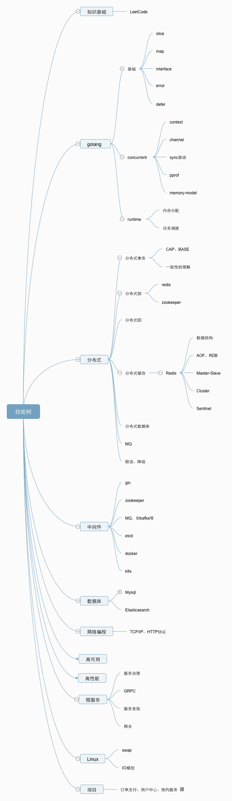

## Mysql

> MySQL与版本、机器配置、架构有比较大的关系。

主从版本

mysql 5.7

SysBench参数：--table_size=25000 --tables=250。

[性能测试](https://help.aliyun.com/document_detail/109378.html?spm=a2c4g.11186623.6.1701.1cb01decGUUbLB)

##### Redis 

- 5.0集群版

#### Kafka

- 0.11

## 脑图

### 书单

《重构》

《代码简洁之道》

《Unix网络编程》

Nginx ：一般情况下，系统的性能瓶颈基本不会是 Nginx。单机 Nginx 可以达到 30w +。
Redis: Redis 官方的性能测试报告：https://redis.io/topics/benchmarks 。从报告中，我们可以得出 Redis 的单机 QPS 可以达到 8w+（CPU 性能有关系，也和执行的命令也有关系比如执行 SET 命令甚至可以达到 10w+QPS）。
MySQL: MySQL 单机的 QPS 为 大概在 4k 左右。