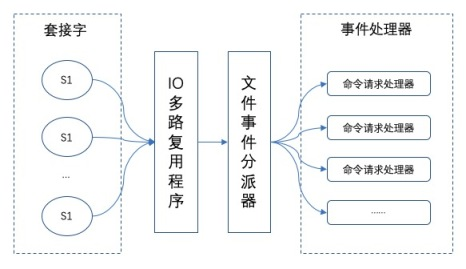
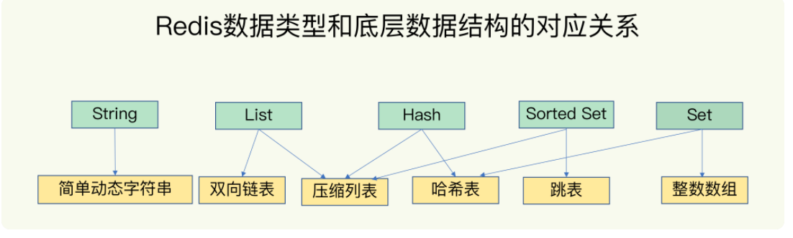
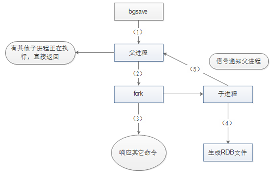
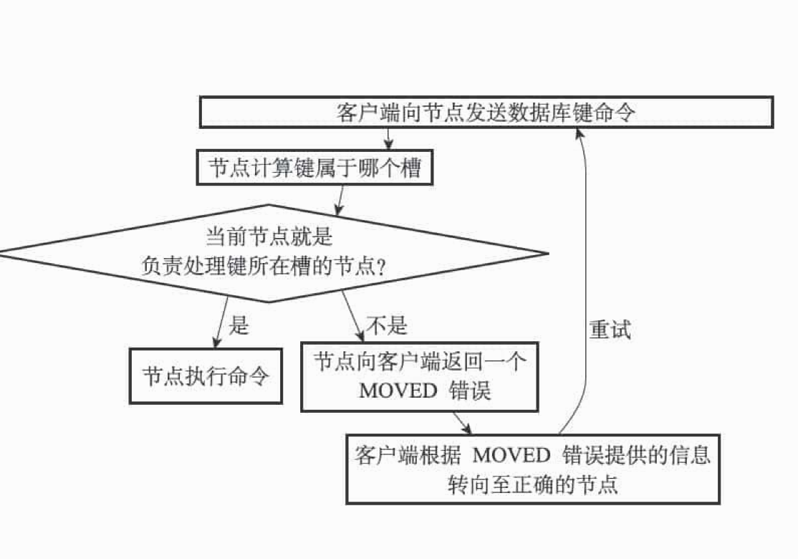
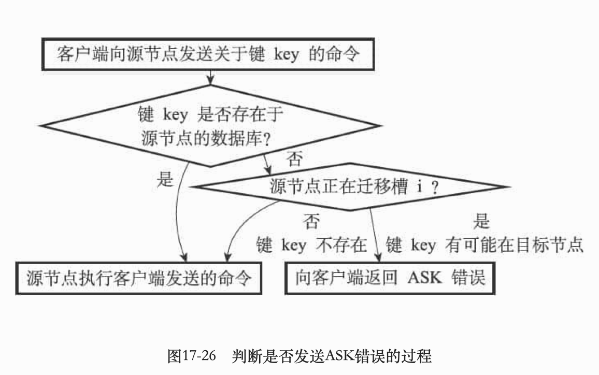
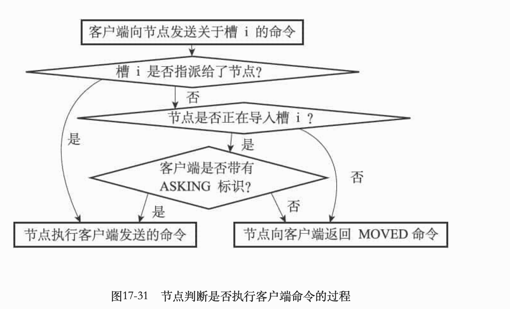

## Q:redis 和 memcached 有啥区别？

- 数据结构：redis 相比 memcached 来说，拥有更多的数据结构，能支持更丰富的数据操作。
- 原生集群：在 redis3.x 版本中，便能支持 cluster 模式，而 memcached 没有原生的集群模式，需要依靠客户端来实现往集群中分片写入数据。

## Q:Redis性能为什么这么高？

- 纯**内存**操作。
- 高效的数据结构，比如：哈希表(查询)、跳表(新增、范围查询)、压缩表(内存占用小、减少垃圾碎片)。
- **单线程（redis文件事件处理器）**反而避免了多线程上下文切换的开销，避免了锁竞争而导致的性能损耗。
- 核心是基于**非阻塞的IO多路复用**。

### IO多路复用是什么？

I/O多路复用是一个同步IO模型，实现一个线程可以监控多个文件句柄。一旦某个文件句柄就绪，就能够通知应用程序进行相应的读写操作；没有文件句柄就绪时会阻塞应用程序，交出cpu。多路是指网络连接，复用指的是同一个线程。

与传统的 多线程/多进程 模型比，I/O多路复用的最大优势是系统开销小，系统不需要创建新的额外进程或者线程，也不需要维护这些进程和线程的运行，降低了系统的维护工作量，节省了系统资源。

#### Select

> 缺点：两次拷贝，两次遍历，1024个文件描述符限制。

- 将已连接的socket都放入一个**文件描述符集合**。
- 然后调用select函数将文件描述符集合**拷贝**到内核里，内核去检查是否有网络事件产生。
- 检查的方式是遍历文件描述符集合，当检查到有事件产生后，将此 Socket 标记为可读或可写， 接着再把整个文件描述符集合**拷贝**回用户态里。
- 然后用户态还需要再通过**遍历**的方法找到可读或可写的 Socket，然后再对其处理。

#### Poll

- 以链表形式来组织，突破了 select 的文件描述符个数限制，当然还会受到系统文件描述符限制。
- 对socket扫描时是线性扫描，采用轮询的方法，效率较低（高并发时）

#### Epoll

> 解决了两个问题：文件描述符在用户态和内核态之间的大量拷贝、增大了处理文件描述符的能力。

- epoll是通过epoll_create和epoll_ctl和epoll_wait三个系统调用完成的。
- 每当接入一个文件描述符，通过ctl添加到内核维护的红黑树中，增删查的时间复杂度是O(logn)。
- 通过事件驱动机制，内核里**维护了一个链表来记录就绪事件**，当某个 socket 有事件发生时，通过回调函数内核会将其加入到这个就绪事件列表中。
- 当用户调用wait时，获取链表中准备好数据的fd，应用程序去处理。


## Q:IO多路复用在redis中的应用？Redis I/O多路复用如何实现？

> IO多路复用模块是Redis文件事件处理器的一部分。主要负责监听多个网络请求，当网络请求有文件事件产生的时候，就会把他们发送给文件事件分配器，文件事件分配器再根据相应的时间类型调用对应的事件处理器。
>
> I/O多路复用模块封装了底层的 `select`、`epoll`、`avport` 以及 `kqueue` 这些 I/O 多路复用函数，根据操作系统类型底层选用不同的函数。 

- Redis服务器是一个事件驱动程序。主线程中的**文件事件处理器**，主要处理客户端的连接请求与响应。
- 每个网络连接都会对应一个文件描述符(FD)，文件事件处理器使用**I/O多路复用模块**同时监听多个FD。
- 当网络连接的 `accept`、`read`、`write` 和 `close` 文件事件产生时，I/O多路复用模块就会把他们传送到**文件事件分配器**。
- 文件事件处理器根据具体的事件类型调用对应的事件处理器。
- I/O多路复用模块封装了底层的 `select`、`epoll`、`avport` 以及 `kqueue` 这些 I/O 多路复用函数，根据操作系统类型底层选用不同的函数。 



## Q:Redis为什么要用单线程？

- Redis是基于内存的操作，读取数据很快，不需要在某个线程读取数据时，切换到另一个线程来执行来提高CPU利用率，所以**CPU不会成为瓶颈**所在，Redis的瓶颈最有可能是机器内存的大小或者网络带宽。
- Redis处理网络请求是单线程模型，并通过IO多路复用来提高并发。但在其他模块，比如持久化、异步删除、集群数据同步是由其他的线程执行的。
- 在Redis6.0中采用多个IO线程来处理网络请求，对于读写命令，Redis依然使用单线程来处理。


## Q:Redis的基本数据类型及底层实现方式？

> [Redis五种数据结构的底层实现原理](https://app.yinxiang.com/shard/s43/nl/13675070/f1e81d8b-bb99-4249-9340-d719e5251ba4)



### 1、String(字符串)

> 一般用于复杂的计数功能的缓存：商品销量，购买保险数量等。

**底层实现方式:动态字符串sds或者long**

String的内部存储结构一般是sds（Simple Dynamic String，可以动态扩展内存），但是如果一个String类型的value的值是数字，那么Redis内部会把它转成long类型(32或者64)来存储，从而减少内存的使用。

### 2、List(链表)

> 项目中认证的用户列表、粉丝列表

**底层实现方式：双向链表(quicklist) **

### 3、Hash(哈希表)

> 适合用于存储对象，因为一个对象的各个属性，正好对应一个hash结构的各个field。比如用户对象包含昵称，加入时间，头像

**底层实现方式：压缩链表(zaplist)或者字典(dict)**

当满足以下两个条件的时候使用压缩链表，其他情况使用字典。

- 元素数量小于等于512；
- 所有value长度少于64字节。

（注意：这两个数值是通过`hash-max-ziplist-entries`和`hash-max-ziplist-value`选项进行）

### 4、Set(集合)

> set是一个存放不重复值的无序集合，可以做全局去重的功能。基于set可以实现交集、并集、差集的操作，计算共同喜好，全部的喜好，自己独有的喜好等功能。

**底层实现方式：整数集合(intset)或者字典(dict) **

当满足以下两个条件的时候使用整数集合，其他情况使用字典。

- 元素数量小于等于512；
- 存储的数据都是整数。

### 5、Sorted Set(有序集合)

> 排行榜、延时队列

**底层实现方式：ziplist(压缩链表)和skiplist(跳表)**

当`sorted set`满足以下两个条件的时候，使用ziplist，不满足这两个条件则使用skiplist。

- 元素数量少于128个。
- 所有member的长度少于64字节。

（注意：这两个数值是通过`redis.conf`的`zset-max-ziplist-entries`和`zset-max-ziplit-value`选项进行）


## Q:为什么有序集合需要同时使用跳跃表和字典来实现？

skiplist编码的有序集合对象使用zset结构作为底层实现，一个zset结构同时包含一个字典和一个跳跃表

```cpp
typedef struct zset{
     //跳跃表
     zskiplist *zsl;
     //字典
     dict *dice;
} zset;
```

字典的键保存元素的值，字典的值则保存元素的分值；跳跃表节点的 object 属性保存元素的成员，跳跃表节点的 score 属性保存元素的分值。

这两种数据结构会**通过指针来共享相同元素的成员和分值**，所以不会产生重复成员和分值，造成内存的浪费。


- 字典，虽然能以 O(1) 的时间复杂度查找成员的分值，但是因为字典是以无序的方式来保存集合元素，所以**每次进行范围操作的时候都要进行排序**；
- 跳跃表来实现，虽然能执行范围操作，**但是查找操作有 O(1)的复杂度变为了O(logN)**。

#### Reference

[有序集合的底层数据结构](https://app.yinxiang.com/shard/s43/nl/13675070/896c9608-224a-4c97-8527-77c0652aae05)


## Q:底层数据结构-dict（字典）

> 冲突解决方法：拉链法
>
> 扩容：增量扩容、rehash分散在各个增删改查中。

 dict 也是一个基于哈希表的算法。和传统的哈希算法类似，它采用哈希函数从 key 计算得到在哈希表中的位置，采用 **拉链法** 解决冲突，并在装载因子（load factor）超过预定值时自动扩展内存，引发重哈希（rehashing）。

Redis 的 dict 实现最显著的一个特点，就在于它的重哈希。它采用了一种称为 **增量式重哈希（incremental rehashing）** 的方法，在需要扩展内存时避免一次性对所有 key 进行重哈希，而是将重哈希操作分散到对于 dict 的各个增删改查的操作中去。这种方法能做到每次只对一小部分 key 进行重哈希，而每次重哈希之间不影响 dict 的操作。

dict之所以这样设计，是为了避免重哈希期间单个请求的响应时间剧烈增加，这与前面提到的“快速响应时间”的设计原则是相符的。

为了实现增量式重哈希（incremental rehashing），dict的数据结构里包含两个哈希表。在重哈希期间，数据从第一个哈希表向第二个哈希表迁移。


## Q:底层数据结构-sds(动态字符串)

```c
/*  
 * 保存字符串对象的结构  
 */  
struct sdshdr {  
    int len;  // buf 中已占用空间的长度  
    int free;  // buf 中剩余可用空间的长度
    char buf[];  // 数据空间  
};
```

SDS 相比C 字符串的优势：

- **获取字符串长度的复杂度为 O(1) **。SDS保存了字符串的长度，而C字符串不保存长度，需要遍历整个数组（找到’\0’为止）才能取到字符串长度。
- **防止缓冲区溢出**。修改SDS时，检查给定SDS空间是否足够，如果不够会先拓展SDS 的空间，防止缓冲区溢出。C字符串不会检查字符串空间是否足够，调用一些函数时很容易造成缓冲区溢出（比如strcat字符串连接函数）。
- **减少修改字符串时带来的内存重分配次数**。空间预分配，惰性空间释放。
  - 惰性空间释放用于优化SDS的字符串缩短操作：当SDS的API需要缩短SDS保存的字符串时，程序并不立即使用内存重分配来回收缩短后多出来的字节，而是使用free属性将这些字节的数量记录起来，并等待将来使用。


## Q:底层数据结构-ziplist

`ziplist`是一个经过特殊编码的双向链表，它的设计目标是为了提高存储效率。ziplist可以用于存储字符串或整数，其中整数是按真正的二进制表示进行编码的，而不是编码成字符串序列。它能以O(1)的时间复杂度在表的两端提供`push`和`pop`操作。

实际上，ziplist充分体现了Redis对于存储效率的追求。一个普通的双向链表，链表中每一项都占用独立的一块内存，各项之间用地址指针（或引用）连接起来。这种方式会带来大量的内存碎片，而且地址指针也会占用额外的内存。而ziplist却是将表中每一项存放在前后连续的地址空间内，一个ziplist整体占用一大块内存。它是一个表（list），但其实不是一个链表（linked list）。

另外，ziplist 为了在细节上节省内存，对于值的存储采用了 **变长编码方式**，大概意思是说，对于大的整数，就多用一些字节来存储，而对于小的整数，就少用一些字节来存储。ziplist 的底层结构如下所示：

#### 当ziplist变得很大的时候，它有如下几个缺点：

- 每次插入或修改引发的 realloc 操作会有更大的概率造成内存拷贝，从而降低性能。
- 一旦发生内存拷贝，内存拷贝的成本也相应增加，因为要拷贝更大的一块数据。
- 当 ziplist 数据项过多的时候，在它上面查找指定的数据项就会性能变得很低，因为 ziplist 上的查找需要进行遍历。

## Q:底层数据结构-skiplist

- 一般查找问题的解法分为两大类：平衡树、哈希表。
- skiplist是在有序链表基础上的多层链表。
- 节点插入时会随机出链表的层数，计算过程：
  - 首先，每个节点肯定都有第1层指针（每个节点都在第1层链表里）。
  - 如果一个节点有第i层(i>=1)指针（即节点已经在第1层到第i层链表中），那么它有第(i+1)层指针的概率为p( p = 1/4 )。
  - 节点最大的层数不允许超过一个最大值，记为MaxLevel( MaxLevel = 32 )。


## Q:底层数据结构-intset

intset是一个由整数组成的有序集合，从而便于在上面进行二分查找，用于快速地判断一个元素是否属于这个集合。它在内存分配上与ziplist有些类似，是连续的一整块内存空间，而且对于大整数和小整数（按绝对值）采取了不同的编码，尽量对内存的使用进行了优化。

#### intset与ziplist对比：

- ziplist可以存储任意二进制串，而intset只能存储整数。
- ziplist是无序的，而intset是从小到大有序的。因此，在ziplist上查找只能遍历，而在intset上可以进行二分查找，性能更高。
- ziplist可以对每个数据项进行不同的变长编码（每个数据项前面都有数据长度字段len），而intset只能整体使用一个统一的编码（encoding）。

默认每个quicklist节点上的ziplist大小不能超过8 Kb。

## Q:skiplist与平衡树、哈希表的比较，或者说Redis为甚用跳表而不用平衡树？

> 从使用场景、数据结构、内存占用、实现难度描述

[Redis为什么用跳表而不用平衡树？](https://app.yinxiang.com/shard/s43/nl/13675070/fad53dc3-be67-4914-a2df-7e2e1b3f8f6d)

- **skiplist和各种平衡树（如AVL、红黑树等）的元素是有序排列的，而哈希表不是有序的**。因此，在哈希表上只能做单个key的查找，不适宜做范围查找。所谓范围查找，指的是查找那些大小在指定的两个值之间的所有节点。
- **查找单个key**，skiplist和平衡树的时间复杂度都为O(log n)，大体相当；而哈希表在保持较低的哈希值冲突概率的前提下，查找时间复杂度接近O(1)，性能更高一些。所以我们平常使用的各种Map或dictionary结构，大都是基于哈希表实现的。
- **在做范围查找的时候，平衡树比skiplist操作要复杂**。在平衡树上，我们找到指定范围的小值之后，还需要以中序遍历的顺序继续寻找其它不超过大值的节点。如果不对平衡树进行一定的改造，这里的中序遍历并不容易实现。而在skiplist上进行范围查找就非常简单，只需要在找到小值之后，对第1层链表进行若干步的遍历就可以实现。
- 平衡树的插入和删除操作可能引发子树的调整，逻辑复杂，而skiplist的插入和删除只需要修改相邻节点的指针，操作简单又快速。
- 从**内存占用**上来说，skiplist比平衡树更灵活一些。一般来说，平衡树每个节点包含2个指针（分别指向左右子树），而skiplist每个节点包含的指针数目平均为1/(1-p)，具体取决于参数p的大小(skiplist的层数是随机出来的)。如果像Redis里的实现一样，取p=1/4，那么平均每个节点包含1.33个指针，比平衡树更有优势。
- 从算法实现难度上来比较，skiplist比平衡树要简单得多。


## Q: rehash

- redis的哈希表使用**拉链法**解决键冲突。使用**MurmurHash2算法**。

#### 扩容条件：

> 也可以说：负载因子超过预定值时自动扩容。

- 服务器目前没有在执行BGSAVE命令或者BGREWRITEAOF命令，并且哈希表的负载因子大于等于1。
- 服务器目前正在执行BGSAVE命令或者BGREWRITEAOF命令，并且哈希表的负载因子大于等于5。

#### 扩容后的大小：

- 扩展后ht[1]的大小为第一个大于或者等于`ht[0].used*2`的2的n次方幂(收缩操作的大小也是这样)。比如：ht[0].used当前的值为4，4*2=8，而8（2 3）恰好是第一个大于等于4的2的n次方，所以程序会将ht[1]哈希表的大小设置为8。

#### 缩容条件：

- 当哈希表的负载因子小于0.1时，程序自动开始对哈希表执行收缩操作。

#### 渐进式rehash

> ht[0]:旧空间。
>
> ht[1]:新空间。

- 为了避免rehash对服务器性能造成影响，服务器不是一次性将ht[0]里面的所有键值对全部rehash到ht[1]，而是分多次、渐进式地将ht[0]里面的键值对慢慢地rehash到ht[1]。

#### 渐进式rehash期间的哈希表操作

- 因为在进行渐进式rehash的过程中，字典会同时使用ht[0]和ht[1]两个哈希表，所以在渐进式rehash进行期间，字典的删除（delete）、查找（find）、更新（update）等操作**会在两个哈希表上进行**。
- 在渐进式rehash执行期间，新添加到字典的键值对一律会被保存到ht[1]里面，而ht[0]则不再进行任何添加操作，这一措施保证了ht[0]包含的键值对数量会只减不增，并随着rehash操作的执行而最终变成空表。  


## Q:持久化

### RDB

- 进程中的数据生成快照保存到硬盘
- 启动时可以读取快照文件恢复数据
- 一般来说，RDB 数据快照文件，都是每隔 5 分钟，或者更长时间生成一次，这个时候就得接受一旦 Redis 进程宕机，那么会丢失最近 5 分钟的数据。
- RDB 每次在 `fork` 子进程来执行 RDB 快照数据文件生成的时候，如果数据文件特别大，可能会导致对客户端提供的服务暂停数毫秒，或者甚至数秒。



### AOF
- AOF是将Redis执行的命令记录到日志文件中
- 实时性更好，一般 AOF 会每隔 1 秒，通过一个后台线程执行一次 `fsync` 操作，最多丢失 1 秒钟的数据。
- 文件过大的时候会触发AOF的重写，通过对过期数据、无效命令、命令合并的方式压缩文件。
- AOF 开启后，支持的写 QPS 会比 RDB 支持的写 QPS 低


###  RDB 和 AOF 到底该如何选择

- 不要仅仅使用 RDB，因为那样会导致你丢失很多数据；
- 也不要仅仅使用 AOF，因为那样有两个问题：第一，你通过 AOF 做冷备，没有 RDB 做冷备来的恢复速度更快；第二，RDB 每次简单粗暴生成数据快照，更加健壮，可以避免 AOF 这种复杂的备份和恢复机制的 bug；
- Redis 支持同时开启开启两种持久化方式，我们可以综合使用 AOF 和 RDB 两种持久化机制，用 AOF 来保证数据不丢失，作为数据恢复的第一选择; 用 RDB 来做不同程度的冷备，在 AOF 文件都丢失或损坏不可用的时候，还可以使用 RDB 来进行快速的数据恢复。

### Reference

[Reids持久化](https://www.cnblogs.com/kismetv/p/9137897.html)


## Q:Redis数据淘汰机制

### 对象过期策略

Redis回收过期对象的策略：定期删除+惰性删除

- **惰性删除**：在访问key时，如果发现key已经过期，那么会将key删除。
- **定期删除**：Redis会定期随机抽取设置过期时间的key，主动淘汰一批已过期的key。

### 内存不够时清理

- 第一类 不处理，等报错(默认的配置)

  - noeviction，发现内存不够时，不删除key，执行写入命令时发现内存不够直接返回错误信息。（Redis默认的配置就是noeviction）

- 第二类 从所有结果集中的key中挑选，进行淘汰(随机，lru，lfu三种)

  - allkeys-random 就是从所有的key中**随机**挑选key，进行淘汰
  - allkeys-lru 就是从所有的key中挑选**最近使用时间距离现在最远**的key，进行淘汰
  - allkeys-lfu 就是从所有的key中挑选**使用频率最低**的key，进行淘汰。（这是Redis 4.0版本后新增的策略）

- 第三类 从设置了过期时间的key中挑选，进行淘汰(随机，lru，ttl，lfu)

  这种就是从设置了expires过期时间的结果集中选出一部分key淘汰，挑选的算法有：

  - volatile-random 从设置了过期时间的结果集中**随机**挑选key删除。
  - volatile-lru 从设置了过期时间的结果集中挑选**上次使用时间距离现在最久**的key开始删除
  - volatile-ttl 从设置了过期时间的结果集中挑选可存活时间最短的key开始删除(也就是从哪些**快要过期**的key中先删除)
  - volatile-lfu 从过期时间的结果集中选择使用**频率最低**的key开始删除（这是Redis 4.0版本后新增的策略）
  

### Redis的LRU的实现

- 标准的LRU会维护一个最近最久队列。
- Redis的LRU是根据配置策略，从全部key或者设置过期时间的key中选出N个键，然后再从这N个键中选出最久没有使用的一个key进行淘汰。
- 使用**近似LRU**的原因：
  - 性能问题，由于近似LRU算法只是最多随机采样N个key并对其进行排序，如果精准需要对所有key进行排序，这样近似LRU性能更高。
  - 内存占用问题，redis对内存要求很高，会尽量降低内存使用率，如果是抽样排序可以有效降低内存的占用。
  - 在近似情况下提供可自配置的取样率来提升精准度，例如通过 CONFIG SET maxmemory-samples <count> 指令可以设置取样数，取样数越高越精准，如果你的CPU和内存有足够，可以提高取样数看命中率来探测最佳的采样比例。

### Reference

[彻底弄懂Redis的内存淘汰策略](https://app.yinxiang.com/shard/s43/nl/13675070/db7574de-d805-4a68-978c-6af41f85cda8)


## Q:Redis主从架构

单机的 redis，能够承载的 QPS 大概就在上万到几万不等。对于缓存来说，一般都是用来支撑**读高并发**的。因此架构做成主从(master-slave)架构，一主多从，主负责写，并且将数据复制到其它的 slave 节点，从节点负责读。所有的**读请求全部走从节点**。这样也可以很轻松实现水平扩容，**支撑读高并发**。

### 主从复制的作用：

- 数据冗余：主从复制实现了数据的热备份，是持久化之外的一种数据冗余方式。
- 故障恢复：当主节点出现故障时，可以由从节点提供服务，实现快速的故障恢复；实际上是一种服务冗余。
- 负载均衡：在主从复制的基础上，配合读写分离，可以有主节点提供写服务，由从节点提供读服务，分担服务器负载。提高服务器并发量。
- 主从是高可用的基础。


## Q:主从复制原理：

#### 1、建立连接阶段(或者说准备阶段)：

- **保存主节点信息：**从节点服务器保存主节点服务器的ip和port信息。
- **建立socket连接：**从节点每秒1次调用复制定时函数replicationCron()，如果发现了有主节点可以连接，便会根据主节点的ip和port，创建socket连接。
- **发送ping命令：**从节点成为主节点的客户端之后，发送ping命令进行首次请求，目的是：检查socket连接是否可用，以及主节点是否能够处理请求。
- **身份验证：**如果从节点中设置了masterauth选项，则从节点需要向主节点进行身份验证。

#### 2、数据同步阶段：

- **全量复制：**用于**初次复制或其他无法进行部分复制**的情况，将主节点中的所有数据都发送给从节点，是一个非常重型的操作。
- **部分复制：**用于**网络中断等情况后的复制**，只将中断期间主节点执行的写命令发送给从节点，与全量复制相比更加高效。需要注意的是，如果网络中断时间过长，导致主节点没有能够完整地保存中断期间执行的写命令，则无法进行部分复制，仍使用全量复制。

#### 3、命令传播阶段：

- 数据同步阶段完成后，主从节点进入命令传播阶段；在这个阶段主节点将自己执行的写命令发送给从节点，从节点接收命令并执行，从而保证主从节点数据的一致性。


### Q:全量复制过程

- 从节点判断无法进行部分复制，向主节点发送全量复制的请求；或从节点发送部分复制的请求，但主节点判断无法进行部分复制。
- 主节点收到全量复制的命令后，**执行bgsave**，在后台生成RDB文件，并使用一个**缓冲区**（称为复制缓冲区）记录从现在开始执行的所有写命令。
- 主节点的bgsave执行完成后，将RDB文件发送给从节点；**从节点首先清除自己的旧数据，然后载入接收的RDB文件**，将数据库状态更新至主节点执行bgsave时的数据库状态。
- 主节点将前述复制缓冲区中的所有写命令发送给从节点，从节点执行这些写命令，将数据库状态更新至主节点的最新状态。
- 如果从节点开启了AOF，则会触发bgrewriteaof的执行，从而保证AOF文件更新至主节点的最新状态。


#### 主从复制是非常重型的：

- 主节点通过bgsave命令fork子进程进行RDB持久化，该过程是非常消耗CPU、内存(页表复制)、硬盘IO的。
- 主节点通过网络将RDB文件发送给从节点，对主从节点的带宽都会带来很大的消耗。
- 从节点清空老数据、载入新RDB文件的过程是阻塞的，无法响应客户端的命令；如果从节点执行bgrewriteaof，也会带来额外的消耗。


### Q:部分复制过程

#### 复制偏移量

- 主节点和从节点分别维护一个复制偏移量(offset)，代表的是主节点向从节点传递的字节数。

#### 复制积压缓冲区

- 复制积压缓冲区是由主节点维护的、固定长度的、先进先出(FIFO)队列，默认大小1MB；当主节点开始有从节点时创建，其作用是备份主节点最近发送给从节点的数据。注意，无论主节点有一个还是多个从节点，都只需要一个复制积压缓冲区。
- 在命令传播阶段，主节点除了将写命令发送给从节点，还会发送一份给复制积压缓冲区，作为写命令的备份。

#### 服务器运行ID

- 每个Redis节点(无论主从)，在启动时都会自动生成一个随机ID(每次启动都不一样)。

- 主从节点初次复制时，主节点将自己的runid发送给从节点，从节点将这个runid保存起来；当断线重连时，从节点会将这个runid发送给主节点；主节点根据runid判断能否进行部分复制：

  - 如果从节点保存的runid与主节点现在的runid相同，说明主从节点之前同步过，主节点会继续尝试使用部分复制(到底能不能部分复制还要看offset和复制积压缓冲区的情况)；
  - 如果从节点保存的runid与主节点现在的runid不同，说明从节点在断线前同步的Redis节点并不是当前的主节点，只能进行全量复制。

  

### 命令传播阶段的心跳检测机制

> 在命令传播阶段，除了发送写命令，主从节点还维持着心跳机制：PING和REPLCONF ACK。心跳机制对于主从复制的超时判断、数据安全等有作用。

- 主从节点彼此之间都有心跳检测机制。

- 主节点每隔十秒对从节点发送ping命令。判断从节点是否存活和连接状态。

- 从节点每隔10秒对主节点发送replconf ack命令。给主节点上报自身当前的复制偏移量。

  - **检测网络状态：**主节点可以从两次命令时间间隔去判断是否存在网络延时。
  - **检测数据是否丢失：**从节点上报自身复制偏移量， 检查复制数据是否丢失， 如果从节点数据丢失， 再从主节点的复制缓冲区中拉取丢失数据。
  - **辅助保证从节点的数量和延迟：**Redis主节点中使用min-slaves-to-write和min-slaves-max-lag参数，来保证主节点在不安全的情况下不会执行写命令；所谓不安全，是指从节点数量太少，或延迟过高。例如min-slaves-to-write和min-slaves-max-lag分别是3和10，含义是如果从节点数量小于3个，或所有从节点的延迟值都大于10s，则主节点拒绝执行写命令。而这里从节点延迟值的获取，就是通过主节点接收到REPLCONF ACK命令的时间来判断的，即前面所说的info Replication中的lag值。

  

###  过期key处理
- slave 不会过期 key，只会等待 master 过期 key。如果 master 过期了一个 key，或者通过 LRU 淘汰了一个 key，那么会模拟一条 del 命令发送给 slave。


## Q:Redis是如何实现高可用的

> 高可用是通过设计，减少系统不能提供服务的时间。

- 持久化：主要作用是数据备份，即将数据保存在硬盘，保证数据不会因为进程退出而丢失。
- 主从复制：实现了数据的多机备份，以及对于读操作的复杂均衡和简单的故障恢复。缺点是：故障无法自动恢复，写操作无法负载均衡，存储能力收到单机的限制。
- 哨兵：在主从的基础上实现了自动化的故障恢复。缺点是：写操作无法负载均衡，存储能力收到单机的限制。
- 集群：Redis解决了写操作无法负载均衡，以及存储能力受到单机限制的问题。


## Q:哨兵

### 主要功能

- **集群监控**：负责监控 redis master 和 slave 进程是否正常工作。
- **故障转移**：如果 master node 挂掉了，会自动转移到 slave node 上。
- 消息通知：如果某个 redis 实例有故障，那么哨兵负责发送消息作为报警通知给管理员。
- 配置中心：如果故障转移发生了，通知 client 客户端新的 master 地址。

### Q:哨兵是如何监控的

哨兵通过维护三个连接去监控和通讯

#### 主从节点的命令连接

- 建立时间
  - 主节点：在初始化哨兵完成之后，通过配置中的信息去建立。
  - 从节点：哨兵与主节点建立命令连接后，从主节点的info命令返回信息中获取从节点的ip、port。然后与从节点建立连接。
- 发送内容(连接作用)：
  - info命令：每隔10发送一次。info命令返回主服务器的runid和从服务器的ip、port。哨兵用返回信息可以建立主从服务器的实例结构。
  - ping命令：每隔一秒发送一次。

	#### 主从节点的订阅连接

- 建立时间：与主从节点的命令连接建立时间一样。
- 发送内容(连接作用)：哨兵会每以两秒一次的频率向被监视的主从服务器的 `__sentinel__:hello`频道发送命令。命令内容包含自己本身的信息和在监视的主节点信息。可以通过订阅连接，不同哨兵节点同步信息。

#### 与其他哨兵的命令连接

- 建立时间：在订阅中发现了其他的哨兵节点，然后建立命令连接。

- 发送内容(连接作用)：
  - ping命令，每隔一秒发送一次。
  - 主观下线后发送`is-master-down-by-addr`命令，向同样监控这一主服务器的其他哨兵询问，看它们是否也认为主服务器进入了下线状态。


#### 为什么面向主从服务器要有命令连接和订阅连接？

- 订阅连接中的信息，如果客户端不在线或者断线，客户端就会丢失这个数据。
- 除了订阅消息外，客户端还必须向服务器主动发送命令。


### 宕机的监控

- sdown 是主观宕机，就一个哨兵如果自己觉得一个 master 宕机了(通过ping命令返回信息判断)，那么就是主观宕机。
- odown 是客观宕机，如果 quorum 数量(quorum在启动时设置，不同的哨兵可能会有不同的值)的哨兵都觉得一个 master 宕机了，那么就是客观宕机。


### 领导者哨兵的选举

- Raft算法：监视主节点的所有哨兵都有可能被选为领导者，选举使用的算法是Raft算法；
- Raft算法的基本思路是先到先得：即在一轮选举中，哨兵A向B发送成为领导者的申请，如果B没有同意过其他哨兵，则会同意A成为领导者。一般来说，哨兵选择的过程很快，谁先完成客观下线，一般就能成为领导者。
- 超过半数以上的哨兵同意，那这个哨兵就会被选举为领头哨兵。
- 如果在给定的时间内没有一个哨兵被选举成功，那么各个哨兵在一段时间后会再次进行选举。直到选出领头哨兵。

## Q:故障转移的步骤

- 选择主服务器，并将其转换为主服务器，过滤规则：

  - 先过滤掉最近五秒内没有回复过领头哨兵INFO命令的从服务器。
  - 过滤掉与主服务器断开时间超过 `down-after-milliseconds` 10 倍的从服务器。
  - 按从服务器优先级排序。
  - 相同优先级复制偏移量最大优先级越高。
  - 按运行ID排序，运行ID小的服务器优先。

向选中的服务器发送`slave no one`命令。并以每秒一次的频率发送INFO命令。

- 将已下线的主服务器的其他从服务器改为复制新的主服务器

- 在实例结构中将之前主服务器标记为下线，等重现上线时发送slaveof命令

### 哨兵核心知识

- 哨兵至少需要 3 个实例，来保证自己的健壮性。
- 哨兵 + redis 主从的部署架构，是**不保证数据零丢失**的，只能保证 redis 集群的**高可用**性。
- 对于哨兵 + redis 主从这种复杂的部署架构，尽量在测试环境和生产环境，都进行充足的测试和演练。

### 脑裂问题

- **原因**：脑裂，也就是说，某个 master 所在机器突然**脱离了正常的网络**，跟其他 slave 机器不能连接，但是实际上 master 还运行着。此时哨兵可能就会**认为** master 宕机了，然后开启选举，将其他 slave 切换成了 master。这个时候，集群里就会有两个 master ，也就是所谓的**脑裂**。

- **影响：**虽然某个 slave 被切换成了 master，但是可能 client 还没来得及切换到新的 master，还继续向旧 master 写数据。因此旧 master 再次恢复的时候，会被作为一个 slave 挂到新的 master 上去，自己的数据会清空，重新从新的 master 复制数据。而新的 master 并没有后来 client 写入的数据，因此，这部分数据也就丢失了。
- **解决方案：**要求至少有 1 个 slave，数据复制和同步的延迟不能超过 10 秒。如果说一旦所有的 slave，数据复制和同步的延迟都超过了 10 秒钟，那么这个时候，master 就不会再接收任何请求了。

  


### Reference

[Redis 哨兵集群实现的高可用](https://app.yinxiang.com/shard/s43/nl/13675070/c66ba4de-37fe-4193-a398-df1e6079c280)


## Q:数据分区算法

> 算法主要解决的是数据分区问题

### 哈希取余

- 计算key的hash值，然后对节点数量进行取余，从而决定数据映射到哪个节点上。
- **缺点：**当新增或删减节点时，节点数量发生变化，系统中所有的数据都需要重新计算映射关系，引发大规模数据迁移。

### 一致性哈希

- 将整个哈希值空间组织成一个虚拟的圆环，如下图所示，范围为0-2^32-1；对于每个数据，根据key计算hash值，确定数据在环上的位置，然后从此位置沿环顺时针行走，找到的第一台服务器就是其应该映射到的服务器。
- **缺点：**当节点数量较少时，增加或删减节点，对单个节点的影响可能很大，造成数据的严重不平衡。

### 带虚拟节点的一致性哈希分区

- 在一致性哈希分区的基础上，引入了虚拟节点的概念。**Redis集群中的虚拟节点称为槽**。引入槽以后，数据的映射关系由数据hash->实际节点，变成了数据**hash->槽->实际节点**。
- 在使用了槽的一致性哈希分区中，槽是数据管理和迁移的基本单位。槽解耦了数据和实际节点之间的关系，增加或删除节点对系统的影响很小。
- 槽的数量一般远小于2^32，远大于实际节点的数量；在Redis集群中，槽的数量为16384，使用的算法是CRC16。

### 节点间通信机制

- 两个端口

  - 普通端口：为客户端提供服务（与单机节点类似）；但在节点间数据迁移时也会使用。
  - 集群端口：端口号是普通端口+10000（10000是固定值，无法改变），集群端口只用于节点之间的通信，如搭建集群、增减节点、故障转移等操作时节点间的通信。
- Gossip协议
  - 在节点数量有限的网络中，每个节点都“随机”的与部分节点通信（并不是真正的随机，而是根据特定的规则选择通信的节点），经过一番杂乱无章的通信，每个节点的状态很快会达到一致。
  - 优点：有负载(比广播)低、去中心化、容错性高(因为通信有冗余)等。
  - 缺点：主要是集群的收敛速度慢。

- Gossip协议类型

  > 集群中的节点采用固定频率（每秒10次）的定时任务进行通信相关的工作

  - meet：某个节点收到客户端的CLUSTER MEET命令时，发送 meet 给新加入的节点，让新节点加入集群中，然后新节点就会开始与其它节点进行通信。
  - ping：每个节点都会频繁给其它节点发送 ping，其中包含自己的状态还有自己维护的集群元数据，互相通过 ping 交换元数据。
  - pong：返回 ping 和 meeet，包含自己的状态和其它信息，也用于信息广播和更新。
  - fail：某个节点判断另一个节点 fail 之后，就发送 fail 给其它节点，通知其它节点说，某个节点宕机了。

### Q:集群的MOVED、ASK、ASKING错误

MOVED:

- 每个节点都会维护集群的槽与节点间的对应关系。
- 当客户端访问的机器中没有命令中的信息，会向客户端返回MOVED错误。
- 收到MOVED错误后会自动连接新的机器。



ASK：

- ASK错误发生在重新分片期间，属于被迁移槽的一部分键值对保存在源节点里，而另一部分保存在目标节点里。
- 客户端收到错误后并不会打印，而是根据错误信息中提供的IP、Port自动转向。




ASKING：

- 接收到ASK错误的客户端会根据错误提供的IP、Port转向正在导入槽的目标节点。
- 然后首先向目标节点发送ASKING命令，之后再重新发送原本想要执行的命令。
- 如果不发送ASKING命令会返回MOVED错误。



### Q: 高可用与主备切换

#### 集群伸缩

- Redis集群可以在不影响对外服务的情况下实现伸缩；**伸缩的核心是槽迁移：修改槽与节点的对应关系，实现槽(即数据)在节点之间的移动**
- 在迁移过程中，如果客户端向正在迁移的源节点发送命令，会收到ASK错误。

#### 故障检测

- 集群中每个节点都会定期向其他节点发送PING消息，以此来检测对方是否在线。如果规定时间内没有收到PONG消息，则认为对方是`pfail`。

- 如果一个节点认为另外一个节点宕机，那么就是 `pfail`，**主观宕机**。如果多个节点都认为另外一个节点宕机了，那么就是 `fail`，**客观宕机**。
- 在 `cluster-node-timeout` 内，某个节点一直没有返回 `pong`，那么就被认为 `pfail`。
- 如果一个节点认为某个节点 `pfail` 了，那么会在 `gossip ping` 消息中，`ping` 给其他节点，如果**超过半数**的节点都认为 `pfail` 了，那么就会变成 `fail`。

- FAIL 状态是单向的，只能从 PFAIL 升级为 FAIL ，当节点重新可达时，可清除 FAIL 标记。


### 故障转移 

- 当从节点发现自己复制的主节点已经下线时(下线由故障检测判断并标记)执行故障转移。
- 在所有从节点中选中一个节点。
  - 从节点发现自己复制的主节点下线时，会向集群广播，要求有投票权的主节点为自己投票。
  - 当票数大于等于N/2+1时(N 为可投票主节点个数)，从节点可以切换成master。
- 被选中的从节点执行SLAVEOF no one命令，成为新的主节点。
- 新的主节点会撤销所有对已下线主节点的槽指派，并将这些槽全部指派给自己。
- 新的主节点向集群广播PONG消息，让集群中其他节点知道自己已经成为主节点。新的主节点开始处理命令。


### Q:集群的限制

- key批量操作受限制.例如mget、mset操作，只有当操作的key都位于一个槽时，才能进行。
  - 解决思路1：在客户端记录槽与key的信息，每次针对特定槽执行mget/mset，本地多线程获取数据。
  - 解决思路2：使用Hash Tag。

- keys、flushall等操作可以在任意节点执行，但是结果只针对当前节点。
- 事务、lua脚本执行的前提条件是，所涉及的所有key必须在同一节点。**Hash Tag可以解决该问题。**
- 集群模式下只可以使用db0

#### Hash Tag

> cluster keyslot {product}:1
>
> 缺点：数据分配不匀。
>
> 有点：只查询一次。

- Hash Tag原理是：当一个key包含 {} 的时候，不对整个key做hash，而仅对 {} 包括的字符串做hash。

- Hash Tag可以让不同的key拥有相同的hash值，从而分配在同一个槽里；这样针对不同key的批量操作(mget/mset等)，以及事务、Lua脚本等都可以支持。不过Hash Tag可能会带来数据分配不均的问题，这时需要：
  - (1)调整不同节点中槽的数量，使数据分布尽量均匀；
  - (2)避免对热点数据使用Hash Tag，导致请求分布不均。

### Reference

[GO redis 集群下的pipline操作](https://app.yinxiang.com/shard/s43/nl/13675070/3f012dc1-e699-4da2-a071-31bd648d0d07)


## Q:缓存雪崩如何解决

**缓存雪崩**是指短时间内大量key失效，导致所有请求全部转向数据库，导致数据库压力过大。

**解决方案**

- 在给缓存设置失效时间时加一个随机值，避免集体失效。
- 双缓存，本地缓存 + redis缓存。

##### 缓存雪崩的事前事中事后的解决方案如下。

- 事前：redis 高可用，主从+哨兵，redis cluster，缓存设置随机过期时间避免全盘崩溃。
- 事中：本地内存缓存(Java有ehcache缓存) + 限流&降级，避免 MySQL 被打死。
- 事后：redis 持久化，一旦重启，自动从磁盘上加载数据，快速恢复缓存数据。


## Q:缓存穿透如何解决

Redis 缓存穿透指的是攻击者故意大量请求一些Redis缓存中不存在key的数据，导致请 求打到数据库上，导致数据库压力过大。

**解决方案**

1. 做好参数校验，无效的请求直接返回，只能避免一部分情况，攻击者总是可以找到一些没有覆盖的情况。
2. 对缓存中找不到的key，需要去数据库查找的key，缓存到Redis中，但是可能会导致Redis中缓存大量无效的key，可以设置一个很短的过期时间，例如1分钟。
3. 也可以使用布隆过滤器，将所有可能的存在的数据通过去hash值的方式存入到一个足够大的bitmap中去，处理请求时，通过在bitmap中查找，可以将不存在的数据拦截掉。


## Q:缓存击穿如何解决

缓存击穿主要指的是某个热点key失效，导致大量请求全部转向数据库，导致数据库压力过大。

**解决方案**

1. 对热点key设置永不过期。
2. 加互斥锁，缓存中没有热点key对应的数据时，等待100ms，由获得锁的线程去读取数据库然后设置缓存。


## Q:解决缓存与数据库一致性问题？

> 分析缓存与数据库一致性问题需要考虑业务中具体的 读写 规模。

严格`数据库+缓存`一致性方案：

- 读写分离：读请求只访问缓存，写请求修改数据库和缓存
- **读请求和写请求串行化**，串行到一个**内存队列**中去。


### 常用的缓存更新策略

#### Cache Aside Pattern

- 读的时候，先读缓存，缓存没有的话，就读数据库，然后取出数据后放入缓存，同时返回响应。
- 更新的时候，**先更新数据库，然后再删除缓存**。

缺点：在更新数据库成功，删除缓存失败的情况下，数据会造成不一致。


### Reference

[如何保证数据库与缓存一致性](https://app.yinxiang.com/shard/s43/nl/13675070/f4ee0e90-4458-4a79-8c88-137c740c799b)

[石彬 双写一致方案](https://github.com/shishan100/Java-Interview-Advanced/blob/master/docs/high-concurrency/redis-consistence.md)


## Q:Redis事务

> redis事务就是一次性、顺序性、排他性的执行一个队列中的一系列命令。

#### Redis事务的三个阶段

1. 事务开始 MULTI
2. 命令入队
3. 事务执行 EXEC

事务执行过程中，如果服务端收到有EXEC、DISCARD、WATCH、MULTI之外的请求，将会把请求放入队列中排队

#### Redis事务相关命令

Redis事务功能是通过MULTI、EXEC、DISCARD和WATCH 四个原语实现的

Redis会将一个事务中的所有命令序列化，然后按顺序执行。

1. **redis 不支持回滚**，“Redis 在事务失败时不进行回滚，而是继续执行余下的命令”， 所以 Redis 的内部可以保持简单且快速。
2. **如果在一个事务中的命令出现错误，那么所有的命令都不会执行**；
3. **如果在一个事务中出现运行错误，那么正确的命令会被执行**。

- WATCH 命令是一个乐观锁，可以为 Redis 事务提供 check-and-set （CAS）行为。 可以监控一个或多个键，一旦其中有一个键被修改（或删除），之后的事务就不会执行，监控一直持续到EXEC命令。
- MULTI命令用于开启一个事务，它总是返回OK。 MULTI执行之后，客户端可以继续向服务器发送任意多条命令，这些命令不会立即被执行，而是被放到一个队列中，当EXEC命令被调用时，所有队列中的命令才会被执行。
- EXEC：执行所有事务块内的命令。返回事务块内所有命令的返回值，按命令执行的先后顺序排列。 当操作被打断时，返回空值 nil 。
- 通过调用DISCARD，客户端可以清空事务队列，并放弃执行事务， 并且客户端会从事务状态中退出。
- UNWATCH命令可以取消watch对所有key的监控。

#### Redis事务保证原子性吗，支持回滚吗

Redis中，单条命令是原子性执行的，但**事务不保证原子性，且没有回滚**。事务中任意命令执行失败，其余的命令仍会被执行。

### reference

[Redis 事务及乐观锁](https://app.yinxiang.com/shard/s43/nl/13675070/522edfee-9b93-4141-abe1-4583f25c4da6)


### 集群方案

#### Redis哈希槽概念

Redis集群没有使用一致性hash,而是引入了哈希槽的概念，Redis集群有16384个哈希槽，每个key通过CRC16校验后对16384取模来决定放置哪个槽，集群的每个节点负责一部分hash槽。

在redis节点发送心跳包时需要把所有的槽放到这个心跳包里，以便让节点知道当前集群信息，16384=16k，在发送心跳包时使用char进行bitmap压缩后是2k（2 * 8 (8 bit) * 1024(1k) = 16K），也就是说使用2k的空间创建了16k的槽数。

详解：[为什么Redis集群有16384个槽](https://www.cnblogs.com/rjzheng/p/11430592.html)

#### Redis集群最大节点个数是多少

16384


### 其他问题

[Redis面试题](https://cloud.tencent.com/developer/article/1612347)

#### Redis与Memcached的区别

[redis和memcached的区别](https://github.com/shishan100/Java-Interview-Advanced/blob/master/docs/high-concurrency/redis-single-thread-model.md)

#### 如何保证缓存与数据库双写时的数据一致性？

[如何保证数据库与缓存的双写一致](https://github.com/shishan100/Java-Interview-Advanced/blob/master/docs/high-concurrency/redis-consistence.md)

#### 布隆过滤器

##### 简介

布隆过滤器（Bloom Filter）是一个基于hash的概率性的数据结构，它实际上是一个很长的二进制向量，可以检查一个元素可能存在集合中，和一定不存在集合中。它的优点是空间效率高，但是有一定false positive(元素不在集合中，但是布隆过滤器显示在集合中)。

##### 原理

布隆过滤器就是一个长度为`m`个bit的bit数组，初始的时候每个bit都是0，另外还有`k`个hash函数。

当加入一个元素时，先用`k`个hash函数得到`k`个hash值，将`k`个hash值与bit数组长度取模得到个`k`个位置，将这`k`个位置对应的bit置位1。

参数设置参考

[白话布隆过滤器](https://blog.huoding.com/2020/06/22/825)

##### 实现

hash函数的选择，murmur3、FNV

[Redis实现布隆过滤器](https://learnku.com/articles/46442)

