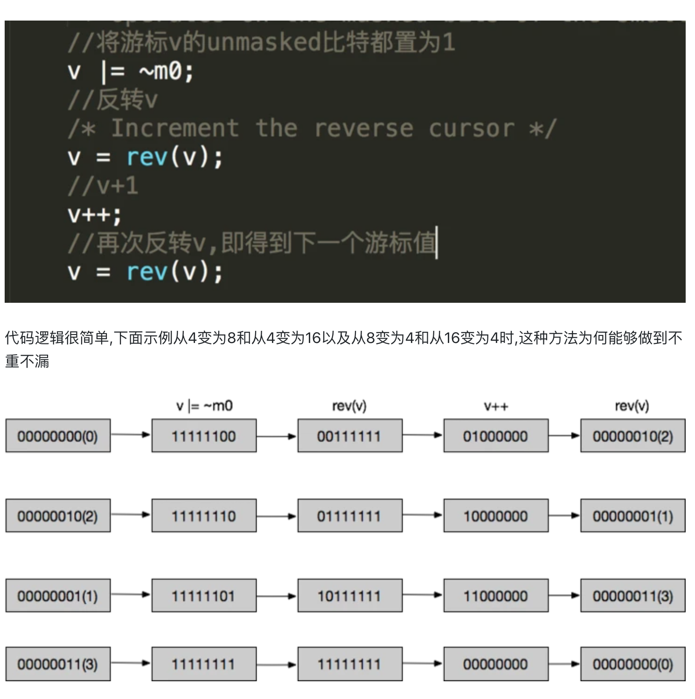

知识点参考书籍《Redis设计与实现》

- 基础数据结构
- 持久化
- 主从
- 哨兵
- 集群

## Redis的hcan会读取到重复数据吗？

> 高位加1的操作保证不读取到重复数据。

- redis里边rehash从小到大时，scan系列命令不会重复也不会遗漏。而从大到小时,有可能会造成重复但不会遗漏。
- 字典遍历的时候通过游标去读取数据。
- 字典命令dictScan结构中游标的实现：反转二进制码进行迭代。
  - 将游标位的unmasked比特都置为1。
  - 反转v，反转之后加1。
  - 再次反转，得到下一个游标的值。

[Redis Scan 命令实现原理， dictScan中游标的实现  ](https://app.yinxiang.com/shard/s43/nl/13675070/6bec9faa-1d68-46ef-973d-96665fd0b620)

## Q:Redis 大key

- 大key是key对应的value占用的内存空间比较大。value最大可以存储512MB。最多可以存储2的32次方-1个元素。value超过10kb就算大key。

#### 大key带来的危害

- 造成数据倾斜，部分redis分片节点存储占用很高。
- 增大网络流量开销。降低QPS。

#### 安全删除

- 命令`memory usage`可以寻找大key。
- lazyfree机制删除大key。`unlink`命令：代替DEL命令；会把对应的大key放到`BIO_LAZY_FREE`后台线程任务队列，然后在后台异步删除；

