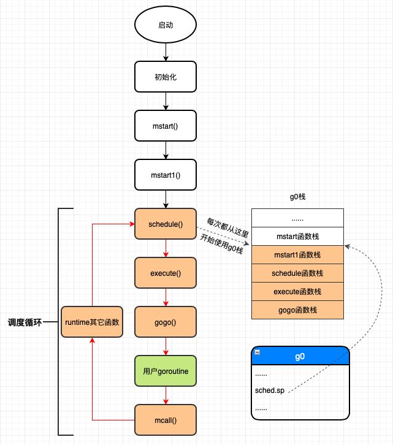

## Q：GMP 是什么？

### G (goroutine)

- 用户态线程，每个工作线程都会有一个g0
- main 本身也是一个goroutine
- goroutine执行同步操作时会被阻塞，goroutine执行异步操作时会进入休眠状态，带操作完成后再恢复，不占用系统线程。

### M (machine)

- 操作系统线程，最多可以创建10000个线程。最多只会有`GOMAXPROCS`个活跃线程正常运行。
- 当 M 没有工作可做的时候，在它休眠前，会“自旋”地来找工作：检查全局队列，查看 network poller，试图执行 gc 任务，或者“偷”工作。
- M只有绑定P才可以能执行G，当M阻塞，P就会启动新的或者是找空闲M继续执行。

### P (process)

- 处理器数量：由启动时环境变量`$GOMAXPROCS`或者`runtime.GOMAXPROCS()`指定。
- 如果是IO密集型，可以将P的数量多设置一些。


### 本地运行队列

- 入队待运行的G优先加到当前的P的本地运行队列，M获取待运行的G也会优先从拥有的P的本地运行队列获取
- 本地运行队列入队和出队不需要使用线程锁。
- 本地运行队列的数量达到256个时会入队到全局运行队列。
- 本地运行队列的数据结构是环形队列，由256长度的数组和两个序号(head, tail)组成。
- 当M从P的本地运行队列获取G时，如果发现本地队列和全局队列为空会尝试从其他P盗取一半的G过来，这个机制叫做 Work Straling。

### 全局队列

- 全局队列保存在全局变量`sched`中，全局运行队列的入队和出队需要使用线程锁。
- 全局运行队列的数据结构是链表，由两个指针(head,tail)组成。

### 空闲M链表

- M发现无运行的G时会进入休眠，并添加到空闲M链表中，空闲M链表保存在全局变量`sched`。进入休眠的M会等待一个信号量(m.park)，唤醒休眠的M会使用这个信号量。

### 空闲P链表

- 当P的本地运行队列中的所有G都运行完毕，又不能从其他地方拿到G时，拥有P的M会释放P并进入休眠状态，释放的P会变为空闲状态并加到空闲P链表中，空闲P链表保存在全局变量`sched`
- 下次运行的G入队时如果发现有空闲的P,但是又没有自旋中的M时会唤醒或者新建一个M，M会拥有这个P，P会重新变为运行中的状态。


## Q:goroutine和线程的区别

### 内存消耗

- goroutine占用2KB,运行中如果占空间不够用会自动扩容。一个http请求会创建一个goroutine。
- thread需要消耗1MB栈内存。还需要使用`a guard page`的区域和其他thread的栈空间进行隔离。

### 创建销毁

- goroutine由go runtime负责管理，创建和销毁都是用户级别。
- thread创建和销毁是内核操作的，解决办法是线程池。

### 切换

- goroutine切换耗时200ns。只需要保存`gobuf`中的三个寄存器sp、pc和bp。
- thread切换使用1000-1500ns。
- 一个纳秒可以执行12-18条指令。


## Q：系统线程对goroutine的调度本质

- 通过保存和修改CPU寄存器的值来达到切换goroutine的目的。
- 当 goroutine 被调离 CPU 时，调度器负责把 CPU 寄存器的值保存在 g 对象的成员变量之中。
- 当 goroutine 被调度起来运行时，调度器又负责把 g 对象的成员变量所保存的寄存器值恢复到 CPU 的寄存器。


## Q:go scheduler的初始化

> g0初始化、主线程绑定m0、m0初始化、初始化allp

### 初始化g0

```c
// runtime/asm_amd64.s:98
//下面这段代码从系统线程的栈空分出一部分当作g0的栈，然后初始化g0的栈信息和stackgard
MOVQ	$runtime·g0(SB), DI	//g0的地址放入DI寄存器
LEAQ	(-64*1024+104)(SP), BX	//BX = SP - 64*1024 + 104
MOVQ	BX, g_stackguard0(DI)		//g0.stackguard0 = SP - 64*1024 + 104
MOVQ	BX, g_stackguard1(DI)		//g0.stackguard1 = SP - 64*1024 + 104
MOVQ	BX, (g_stack+stack_lo)(DI)	//g0.stack.lo = SP - 64*1024 + 104
MOVQ	SP, (g_stack+stack_hi)(DI)	//g0.stack.hi = SP
```


- g0栈大约64K

### 主线程与m0绑定

```c
// runtime/asm_amd64.s:183
//下面开始初始化tls(thread local storage,线程本地存储)
LEAQ	runtime·m0+m_tls(SB), DI  //DI = &m0.tls，取m0的tls成员的地址到DI寄存器
CALL	runtime·settls(SB)  //调用settls设置线程本地存储，settls函数的参数在DI寄存器中

// store through it, to make sure it works
//验证settls是否可以正常工作，如果有问题则abort退出程序
get_tls(BX)		 //获取fs段基地址并放入BX寄存器，其实就是m0.tls[1]的地址，get_tls的代码由编译器生成
MOVQ	$0x123, g(BX) 	//把整型常量0x123拷贝到fs段基地址偏移-8的内存位置，也就是m0.tls[0] = 0x123
MOVQ	runtime·m0+m_tls(SB), AX	 //AX = m0.tls[0]
CMPQ	AX, $0x123		//检查m0.tls[0]的值是否是通过线程本地存储存入的0x123来验证tls功能是否正常
JEQ 2(PC)
CALL	runtime·abort(SB)	 //如果线程本地存储不能正常工作，退出程序
```

- **为什么要把m和工作线程绑定在一起**:每个工作线程拥有了各自私有的m结构体全局变量，我们就能在不同的工作线程中使用相同的全局变量名来访问不同的m结构体对象。

### m0与g0绑定

```c
// runtime/asm_amd64.s:194
// set the per-goroutine and per-mach "registers"
get_tls(BX)		 //获取fs段基址到BX寄存器
LEAQ	runtime·g0(SB), CX		 //CX = g0的地址
MOVQ	CX, g(BX)					 //把g0的地址保存在线程本地存储里面，也就是m0.tls[0]=&g0
LEAQ	runtime·m0(SB), AX  //AX = m0的地址

// 把m0和g0关联起来m0->g0 = g0，g0->m = m0
// save m->g0 = g0
MOVQ	CX, m_g0(AX)
// save m0 to g0->m
MOVQ	AX, g_m(CX)
```

- m0和g0绑定在一起，这样，之后在主线程中通过get_tls可以获取到g0，通过g0的m成员又可以找到m0，于是这里就实现了m0和g0与主线程之间的关联

### 初始化m0

### 初始化P、allp


## Q:调度循环

```go
schedule()->execute()->gogo()->g2()->goexit()->goexit1()->mcall()->goexit0()->schedule()
```



### mstart作用

- 由`rt0_go`汇编程序完成一系列启动后的初始化后调用
- 主线程进入调度循环，运行刚刚创建的goroutine

### mstart1作用 

- 调用save函数来保存g0的调度信息
- 执行信号初始化函数`mstartm0`，这个函数注册信号

### schedule作用

- 由工作线程的g0运行，寻找需要运行的goroutine

### execute作用

- 把待运行的g和m关联起来

- 关联设置g的运行状态为`_Grunning`

### gogo作用

- 汇编程序，从g0切换到用户goroutine(gp)。本质上是CPU执行权的转让以及栈的切换

### runtime.main函数

- 只是在main goroutine初始化后执行
- runtime.main是main.main的入口函数，由schedule()->execute()->gogo()这个调用链的gogo函数中用汇编代码跳转过去的
- 作用：启动一个sysmon系统监控线程；runtime包初始化；执行main包以及main包import的所有的包的初始化；执行main.main(我们写的函数)；执行exit(0)系统调用


### goexit作用

- 汇编程序，调用goexit1函数

### goexit1函数

- 通过调用mcall从当前运行的g2 goroutine切换到g0，然后在g0栈上调用和执行goexit0这个函数。

### mcall作用

- 汇编程序，从当前运行的g切换到g0

### goexit0函数

- g0执行
- 设置g的状态为`_Gdead`
- 清空g的信息
- 调用`dropg`解绑g和m的关系
- 调用`gfput`,将g放入p的freeg队列


## Q: M是如何找工作的？或者说调度策略是什么？

> 调度系统三大核心问题
> 调度时机：什么时候会发生调度？
> 调度策略：使用什么策略来挑选下一个进入运行的goroutine？
> 切换机制：如何把挑选出来的goroutine放到CPU上运行？

### 全局运行队列寻找goroutine

- 调度策略函数的执行入口都是在`schedule`

```go
// runtime/proc.go:4863
func globrunqget(_p_ *p, max int32) *g {
	if sched.runqsize == 0 {	// 全局队列为空
		return nil
	}

  // 根据P的数量平分全局运行队列中的goroutine
	n := sched.runqsize/gomaxprocs + 1
	if n > sched.runqsize {	 //上面计算n的方法可能导致n大于全局运行队列中的goroutine数量
		n = sched.runqsize
	}
	if max > 0 && n > max {
		n = max		//最多取max个goroutine
	}
	if n > int32(len(_p_.runq))/2 {
		n = int32(len(_p_.runq)) / 2 // 最多只能取本地队列容量的一半
	}

	sched.runqsize -= n

  // 直接通过函数返回gp，其它的goroutines通过runqput放入本地运行队列
	gp := sched.runq.pop() // pop从全局运行队列的队列头取
	n--
	for ; n > 0; n-- {
		gp1 := sched.runq.pop() // 从全局运行队列中取出一个goroutine
		runqput(_p_, gp1, false)	// 放入本地运行队列
	}
	return gp
}
```

- 每个工作线程每进行61次调度就需要优先从全局运行队列中获取goroutine出来运行，每次获取一个goroutine，获取的时候需要加锁。

- 获取数量： 根据p的数量平分全局运行队列中的goroutines，但是最多只能获取本地队列容量的一半。`n = min(len(GQ)/GOMAXPROCS + 1, len(GQ/2))`
- 第一个g结构体对象通过返回值的方式返回给调用函数，其它的则通过runqput函数放入当前工作线程的本地运行队列。

### 本地运行队列中寻找goroutine

```go
// runtime/proc.go:5027
func runqget(_p_ *p) (gp *g, inheritTime bool) {
	// If there's a runnext, it's the next G to run.
  //从runnext成员中获取goroutine
	for {
    // 查看runnext成员是否为空，不为空则返回该goroutine 
		next := _p_.runnext
		if next == 0 {
			break
		}
    // 只有和_p_绑定的当前工作线程才会去修改runnext的值，所以不会有ABA问题
		if _p_.runnext.cas(next, 0) {
			return next.ptr(), true
		}
	}

  // 从循环队列中获取goroutine
	for {
    // 从逻辑上已经杜绝了引发ABA的条件
		h := atomic.LoadAcq(&_p_.runqhead) // load-acquire, synchronize with other consumers
		t := _p_.runqtail
		if t == h {
			return nil, false
		}
		gp := _p_.runq[h%uint32(len(_p_.runq))].ptr()
		if atomic.CasRel(&_p_.runqhead, h, h+1) { // cas-release, commits consume
			return gp, false
		}
	}
}
```

- 从与m关联的p的本地队列中寻找。首选读取runnext中的值，如果读取不到再从循环队列中获取。
  - runnxt添加时机：在有需要唤醒的goroutine时，goroutine的状态会被设置为——Grunnable，添加使用cas，如果失败则继续重试。
- 获取g的操作都使用cas，因为可能存在其他线程也正在偷取可运行的g。
- p的runqtail不会被其它线程修改，只会被当前工作线程修改，所以不需要使用原子操作。

### 从其他运行队列寻找goroutine

- 在偷取之前要再次检查本地和全局运行队列是否有可运行的goroutine。
- 如果系统中自旋状态的m超过非空闲状态的一半，则直接去休眠，休眠之前要再次检查是否有工作要做。
- 进入自旋状态，并从其他线程偷取goroutine。
- 偷取工作会固定尝试四次

#### 工作线程M的自旋状态(spinning)

- 工作线程在从其它工作线程的本地运行队列中盗取goroutine时的状态称为自旋状态。

#### 盗取算法

- 遍历allp中的所有p，查看其运行队列是否有goroutine，如果有，则取其一半到当前工作线程的运行队列，然后从findrunnable返回，如果没有则继续遍历下一个p。
- 为了保证公平性，遍历allp时并不是固定的从allp[0]即第一个p开始，而是从随机位置上的p开始。
- 使用伪随机算法实现。[具体实现](https://mp.weixin.qq.com/s/o2UmxmFFOwUAkgE-Ao9MsA)

#### 工作线程的睡眠

- 睡眠前先解除工作线程与p的绑定，把p放入空闲队列。
- 睡眠之前还会再次检查是否有工作要做。
- 把m结构体放入sched的midle空闲队列
- note是go runtime实现的一次性睡眠和唤醒机制，一个线程可以通过调用notesleep(*note)进入睡眠状态，而另外一个线程则可以通过notewakeup(*note)把其唤醒。


## Q：触发调度的条件是什么？

> go语言的调度器会在以下三种情况下对goroutine进行调度：
> 被动调度：goroutine执行某个操作因条件不满足需要等待而发生的调度；
> 主动调度：goroutine主动调用Gosched()函数让出CPU而发生的调度；
> 抢占调度：goroutine运行时间太长或长时间处于系统调用之中而被调度器剥夺运行权而发生的调度。

## Q: 被动调度：goroutine产生后的去向？channel上goroutine读取阻塞执行步骤？goroutine唤起执行步骤？

### goroutine产生后的去向

- `runqput`函数执行，优先把goroutine放入P的本地队列，如果队列满了则通过runqputslow函数放入全局队列。
- 放入全局运行队列之前要先使用链表把从本地队列中取出的一半连同新生成的goroutine一起串联起来，然后在加锁成功之后通过globrunqputbatch函数把该链表链入全局运行队列。

### 因读取channel阻塞而发生的被动调度

- channel读取发生的阻塞会执行gopark函数
- 函数内部通过一系类调用会最终切换到g0设置当期状态为`_Gwaiting`
- 解除g和m的关系，并进入下个调度循环
- 等待状态的g存在于 Channel 的读取队列上

### 唤起阻塞在channel上的goroutine

- ready函数**首先把需要唤醒的goroutine的状态设置为_Grunnable**，然后把其放入运行队列的runnext之中等待调度器的调度。
- 当前有空闲的P而且没有正在偷取goroutine的工作线程(没有处于sinning状态的工作线程)，则需要唤醒p出来工作。(!!!p唤起的触发)


## Q:工作线程的唤醒及创建

### 唤醒空闲的P

> 为了充分利用CPU，ready函数在唤醒goroutine之后会去判断是否需要启动新工作线程出来工作，判断规则是，如果当前有空闲的p而且没有工作线程正在尝试从各个工作线程的本地运行队列偷取goroutine的话（没有处于spinning状态的工作线程），那么就需要把空闲的p唤醒起来工作.

- 因为P的数量其实是一定的，startm首先会判断是否有空闲的P结构体对象，如果没有则直接返回，如果有则需要创建或唤醒一个工作线程出来与之绑定。
- 在确保有可以绑定的p对象之后，startm函数首先尝试从m的空闲队列中查找正处于休眠状态的工作线程，如果找到则通过notewakeup函数唤醒它，否则调用newm函数创建一个新的工作线程出来。

### 唤醒睡眠中的工作线程

- 唤醒需要做系统调用进入内核，被唤醒的工作线程则由内核负责在适当的时候调度到CPU上运行。

### 创建工作线程

- 从堆上分配一个m结构体对象
- 创建线程和M绑定，最终调用mstart


## Q:主动调度

- g的状态变更`_Grunning`->`_Grunnale`
- 解除工作线程m和g之间的关系
- 主动调度之后g去了全局队列


## Q:发生抢占调度的时机

- sysmon系统监控线程会定期（10毫秒）通过retake函数对goroutine发起抢占。
  - 抢占会标注g结构体中的preempt成员为true和stackguard0成员为stackPreempt（stackPreempt是一个常量0xfffffffffffffade，是非常大的一个数）就返回了，并未真正强制被抢占的goroutine暂停下来。
- _Prunning（运行状态的P）：正在运行的goroutine超过10ms则需要抢占。
- _Pssyscall（系统调用状态的P）：goroutine在内核执行系统调用。


## Q: 响应抢占请求

### 1.12-1.14时间运行过长导致的抢占

- 在函数调用之前检查
- newstack函数首先检查g.stackguard0是否被设置为stackPreempt，如果是则表示sysmon已经发现我们运行得太久了并对我们发起了抢占请求。
- 调度切换工作会把g的状态从`_Grunning`切换到`_Grunnable`，解除当前工作线程m和gp之间的关系，然后把gp放入全局队列等待被调度器调度，最后调用schedule()函数进入新一轮调度

### 信号抢占

##### 信号发送

系统监控中通过`sysmon()->retake()->preemptone()->preemptM()->signalM()`将在初始化的安装的 `_SIGURG` 信号发送到指定的 M 上。

使用 preemptM 发送抢占信号的地方主要有下面几个：

1. Go 后台监控 runtime.sysmon 检测超时发送抢占信号；
2. Go GC 栈扫描发送抢占信号；
3. Go GC STW 的时候调用 preemptall 抢占所有 P，让其暂停；

##### 执行抢占信号

> 函数调用链：runtime·sigtramp->runtime·sigtrampgo()->sighandler()->doSigPreempt()
>
> runtime·sigtramp  :  src/runtime/sys_linux_amd64.s
>
> runtime·sigtrampgo  :    runtime/signal_unix.go

- m放弃g，并放入全局队列

### 系统调用时间过长的抢占

> 对于系统调用执行时间过长的goroutine，调度器并没有暂停其执行，只是剥夺了正在执行系统调用的工作线程所绑定的p，要等到工作线程从系统调用返回之后绑定p失败的情况下该goroutine才会真正被暂停运行。

#### 进行抢占的条件，只要满足一个就抢占

- p的运行队列里面有等待运行的goroutine。
- 没有空闲的p。
- 从上一次监控线程观察到p对应的m处于系统调用之中到现在已经超过10了毫秒。

#### 执行

- 使用cas修改p的状态(修改为pidle)来获取p的使用权。原因：工作线程此时此刻可能正好从系统调用返回了，也正在获取p的使用权。
- 如果获取了p的使用权，则通过`handoffp`函数获取新的工作线程来绑定p


## Q:goroutine执行系统调用

```go
// runtime/proc.go : 3561
// Standard syscall entry used by the go syscall library and normal cgo calls.
//go:nosplit
func entersyscall() {
    reentersyscall(getcallerpc(), getcallersp())
}

func reentersyscall(pc, sp uintptr) {
    _g_ := getg()  //执行系统调用的goroutine

    // Disable preemption because during this function g is in Gsyscall status,
    // but can have inconsistent g->sched, do not let GC observe it.
    _g_.m.locks++

    // Entersyscall must not call any function that might split/grow the stack.
    // (See details in comment above.)
    // Catch calls that might, by replacing the stack guard with something that
    // will trip any stack check and leaving a flag to tell newstack to die.
    _g_.stackguard0 = stackPreempt
    _g_.throwsplit = true

    // Leave SP around for GC and traceback.
    save(pc, sp)  //save函数分析过，用来保存g的现场信息，rsp, rbp, rip等等
    _g_.syscallsp = sp
    _g_.syscallpc = pc
    casgstatus(_g_, _Grunning, _Gsyscall) 
    ......
    _g_.m.syscalltick = _g_.m.p.ptr().syscalltick
    _g_.sysblocktraced = true
    _g_.m.mcache = nil
    pp := _g_.m.p.ptr()
    pp.m = 0  //p解除与m之间的绑定
    _g_.m.oldp.set(pp)   //把p记录在oldp中，等从系统调用返回时，优先绑定这个p
    _g_.m.p = 0  //m解除与p之间的绑定
    atomic.Store(&pp.status, _Psyscall)  //修改当前p的状态，sysmon线程依赖状态实施抢占
    .....
    _g_.m.locks--
}
```

- 记录g的寄存器信息
- 将p的信息记录在m.oldp中
- 解除p和m的绑定关系


## Q:goroutine系统调用完成之后流程

- 尝试绑定进入系统调用之前所使用的p
- 如果之前的p获取不到，就调用`exitsyscallfast_pidle`去获取空闲的p来绑定
- 如果没有p可以绑定，则掉用`exitsyscall0`解除m和g的关系，把g放入全局队列，自己睡眠


## Q:为什么需要 P 这个组件，直接把 G 放到 M 不行吗？

### P的作用：

- **减少全局队列的锁竞争**。每个 P 有自己的本地队列，大幅度的减轻了对全局队列的直接依赖，所带来的效果就是锁竞争的减少。
- **提高资源利用率**。P的本地队列为空的时候会从全局或者其他的P本地队列盗取G，减少空转，提高资源利用率。

### 把G直接放到M上

- 当G阻塞的时候就会阻塞M，M阻塞不够用会起更多的M。
- M阻塞就会起新的M，本地队列增多，执行work stealing性能降低。


## Q:为什么是协作式调度

语言运行在用户态，没有中断或者系统调用这样的机制来打断代码的执行。只能靠任务主动调用schedule()，才会有机会调度。


## Q:G0的作用

- 调度器自旋
- 线程创建的第一个goroutine，创建后不断寻找其他的goroutine来执行
- 创建 `goroutine`、`deferproc` 函数里新建 `_defer`、垃圾回收相关的工作（例如 stw、扫描 goroutine 的执行栈、一些标识清扫的工作、栈增长）等等。


## Q:监控线程做了什么

- `sysmon` 执行一个无限循环，一开始每次循环休眠 20us，之后（1 ms 后）每次休眠时间倍增，最终每一轮都会休眠 10ms。
- `sysmon` 中会进行 netpool（获取 fd 事件）、retake（抢占）、forcegc（按时间强制执行 gc），scavenge heap（释放自由列表中多余的项减少内存占用）等处理。


## Reference

[任务调度源码](https://www.cnblogs.com/zkweb/p/7815600.html)

[go 调度器的实现  G P 的状态流转](https://draveness.me/golang/docs/part3-runtime/ch06-concurrency/golang-goroutine/#%E8%BF%90%E8%A1%8C%E9%98%9F%E5%88%97)

[调度器GMP原理加示例分析](https://learnku.com/articles/41728)

[调度器的源码解读-关键点，基于1.2源码，缺少基于信号的抢占式调度 ](https://mp.weixin.qq.com/mp/homepage?__biz=MzU1OTg5NDkzOA==&hid=1&sn=8fc2b63f53559bc0cee292ce629c4788&scene=18#wechat_redirect)

[码农桃花源调度器](https://qcrao.com/2019/09/06/dive-into-go-scheduler-source-code/)

[Go语言信号抢占](https://www.luozhiyun.com/archives/485)

[gdb调试go方法](https://favoorr.github.io/2017/02/26/gdb-trace-go-function-call/)

[goroutine背后的系统知识](http://www.sizeofvoid.net/goroutine-under-the-hood/)

