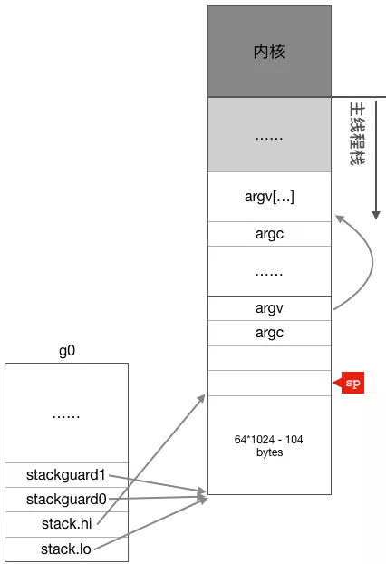

## Q：GMP 是什么？

### G (goroutine)

- 用户态线程，每个工作线程都会有一个g0
- main 本身也是一个goroutine
- goroutine执行同步操作时会被，goroutine执行异步操作时会进入休眠状态，带操作完成后再恢复，不占用系统线程。

### M (machine)

- 操作系统线程，最多可以创建10000个线程。最多只会有`GOMAXPROCS`个活跃线程正常运行。
- 当 M 没有工作可做的时候，在它休眠前，会“自旋”地来找工作：检查全局队列，查看 network poller，试图执行 gc 任务，或者“偷”工作。
- M只有绑定P才可以能执行G，当M阻塞，P就会启动新的或者是找空闲M继续执行。

### P (process)

- 处理器数量：由启动时环境变量`$GOMAXPROCS`或者`runtime.GOMAXPROCS()`指定


### 本地运行队列

- 入队待运行的G优先加到当前的P的本地运行队列，M获取待运行的G也会优先从用友的P的本地运行队列获取
- 本地运行队列入队和出队不需要使用线程锁。
- 本地运行队列的数量达到256个时会入队到全局运行队列。
- 本地运行队列的数据结构是环形队列，由256长度的数组和两个序号(head, tail)组成。
- 当M从P的本地运行队列获取G时，如果发现本地队列和全局队列为空会尝试从其他P盗取一半的G过来，这个机制叫做 Work Straling。

### 全局队列

- 全局队列保存在全局变量`sched`中，全局运行队列的入队和出队需要使用线程锁。
- 全局运行队列的数据结构是链表，由两个指针(head,tail)组成。

### 空闲M链表

- M发现无运行的G时会进入休眠，并添加到空闲M链表中，空闲M链表保存在全局变量`sched`。进入休眠的M会等待一个信号量(m.park)，唤醒休眠的M会使用这个信号量。

### 空闲P链表

- 当P的本地运行队列中的所有G都运行完毕，又不能从其他地方拿到G时，拥有P的M会释放P并进入休眠状态，释放的P会变为空闲状态并加到空闲P链表中，空闲P链表保存在全局变量`sched`
- 下次运行的G入队时如果发现有空闲的P,但是又没有自旋中的M时会唤醒或者新建一个M，M会拥有这个P，P会重新变为运行中的状态。


## Q:goroutine和线程的区别

### 内存消耗

- goroutine占用2KB,运行中如果占空间不够用会自动扩容。一个http请求会创建一个goroutine。
- thread需要消耗1MB栈内存。还需要使用`a guard page`的区域和其他thread的栈空间进行隔离。

### 创建销毁

- goroutine由go runtime负责管理，创建和销毁都是用户级别。
- thread创建和销毁是内核操作的，解决办法是线程池。

### 切换

- goroutine切换耗时200ns。只需要保存`gobuf`中的三个寄存器sp、pc和bp。
- thread切换使用1000-1500ns。
- 一个纳秒可以执行12-18条指令。


## Q：系统线程对goroutine的调度本质

- 通过保存和修改CPU寄存器的值来达到切换goroutine的目的。
- 当 goroutine 被调离 CPU 时，调度器负责把 CPU 寄存器的值保存在 g 对象的成员变量之中。
- 当 goroutine 被调度起来运行时，调度器又负责把 g 对象的成员变量所保存的寄存器值恢复到 CPU 的寄存器。


## Q:go scheduler的初始化

> g0初始化、主线程绑定m0、m0初始化、初始化allp

### 初始化g0

```c
// runtime/asm_amd64.s:98
//下面这段代码从系统线程的栈空分出一部分当作g0的栈，然后初始化g0的栈信息和stackgard
MOVQ	$runtime·g0(SB), DI	//g0的地址放入DI寄存器
LEAQ	(-64*1024+104)(SP), BX	//BX = SP - 64*1024 + 104
MOVQ	BX, g_stackguard0(DI)		//g0.stackguard0 = SP - 64*1024 + 104
MOVQ	BX, g_stackguard1(DI)		//g0.stackguard1 = SP - 64*1024 + 104
MOVQ	BX, (g_stack+stack_lo)(DI)	//g0.stack.lo = SP - 64*1024 + 104
MOVQ	SP, (g_stack+stack_hi)(DI)	//g0.stack.hi = SP
```



- g0栈大约64K

### 主线程与m0绑定

```c
// runtime/asm_amd64.s:183
//下面开始初始化tls(thread local storage,线程本地存储)
LEAQ	runtime·m0+m_tls(SB), DI  //DI = &m0.tls，取m0的tls成员的地址到DI寄存器
CALL	runtime·settls(SB)  //调用settls设置线程本地存储，settls函数的参数在DI寄存器中

// store through it, to make sure it works
//验证settls是否可以正常工作，如果有问题则abort退出程序
get_tls(BX)		 //获取fs段基地址并放入BX寄存器，其实就是m0.tls[1]的地址，get_tls的代码由编译器生成
MOVQ	$0x123, g(BX) 	//把整型常量0x123拷贝到fs段基地址偏移-8的内存位置，也就是m0.tls[0] = 0x123
MOVQ	runtime·m0+m_tls(SB), AX	 //AX = m0.tls[0]
CMPQ	AX, $0x123		//检查m0.tls[0]的值是否是通过线程本地存储存入的0x123来验证tls功能是否正常
JEQ 2(PC)
CALL	runtime·abort(SB)	 //如果线程本地存储不能正常工作，退出程序
```

- **为什么要把m和工作线程绑定在一起**:每个工作线程拥有了各自私有的m结构体全局变量，我们就能在不同的工作线程中使用相同的全局变量名来访问不同的m结构体对象。

### m0与g0绑定

```c
// runtime/asm_amd64.s:194
// set the per-goroutine and per-mach "registers"
get_tls(BX)		 //获取fs段基址到BX寄存器
LEAQ	runtime·g0(SB), CX		 //CX = g0的地址
MOVQ	CX, g(BX)					 //把g0的地址保存在线程本地存储里面，也就是m0.tls[0]=&g0
LEAQ	runtime·m0(SB), AX  //AX = m0的地址

// 把m0和g0关联起来m0->g0 = g0，g0->m = m0
// save m->g0 = g0
MOVQ	CX, m_g0(AX)
// save m0 to g0->m
MOVQ	AX, g_m(CX)
```

- m0和g0绑定在一起，这样，之后在主线程中通过get_tls可以获取到g0，通过g0的m成员又可以找到m0，于是这里就实现了m0和g0与主线程之间的关联

### 初始化m0

### 初始化P、allp


## Q: M是如何找工作的？或者说调度策略是什么？

### 全局运行队列寻找goroutine

```go
// runtime/proc.go:4863
func globrunqget(_p_ *p, max int32) *g {
	if sched.runqsize == 0 {	// 全局队列为空
		return nil
	}

  // 根据P的数量平分全局运行队列中的goroutine
	n := sched.runqsize/gomaxprocs + 1
	if n > sched.runqsize {	 //上面计算n的方法可能导致n大于全局运行队列中的goroutine数量
		n = sched.runqsize
	}
	if max > 0 && n > max {
		n = max		//最多取max个goroutine
	}
	if n > int32(len(_p_.runq))/2 {
		n = int32(len(_p_.runq)) / 2 // 最多只能取本地队列容量的一半
	}

	sched.runqsize -= n

  // 直接通过函数返回gp，其它的goroutines通过runqput放入本地运行队列
	gp := sched.runq.pop() // pop从全局运行队列的队列头取
	n--
	for ; n > 0; n-- {
		gp1 := sched.runq.pop() // 从全局运行队列中取出一个goroutine
		runqput(_p_, gp1, false)	// 放入本地运行队列
	}
	return gp
}
```

- 每个工作线程每进行61次调度就需要优先从全局运行队列中获取goroutine出来运行，每次获取一个goroutine，获取的时候需要加锁。

- 获取数量： 根据p的数量平分全局运行队列中的goroutines，但是最多只能获取一半。`n = min(len(GQ)/GOMAXPROCS + 1, len(GQ/2))`
- 第一个g结构体对象通过返回值的方式返回给调用函数，其它的则通过runqput函数放入当前工作线程的本地运行队列。

### 本地运行队列中寻找goroutine

```go
// runtime/proc.go:5027
func runqget(_p_ *p) (gp *g, inheritTime bool) {
	// If there's a runnext, it's the next G to run.
  //从runnext成员中获取goroutine
	for {
    // 查看runnext成员是否为空，不为空则返回该goroutine 
		next := _p_.runnext
		if next == 0 {
			break
		}
    // 只有和_p_绑定的当前工作线程才会去修改runnext的值，所以不会有ABA问题
		if _p_.runnext.cas(next, 0) {
			return next.ptr(), true
		}
	}

  // 从循环队列中获取goroutine
	for {
    // 从逻辑上已经杜绝了引发ABA的条件
		h := atomic.LoadAcq(&_p_.runqhead) // load-acquire, synchronize with other consumers
		t := _p_.runqtail
		if t == h {
			return nil, false
		}
		gp := _p_.runq[h%uint32(len(_p_.runq))].ptr()
		if atomic.CasRel(&_p_.runqhead, h, h+1) { // cas-release, commits consume
			return gp, false
		}
	}
}
```

- 从与m关联的p的本地队列中寻找。首选读取runnext中的值，如果读取不到再从循环队列中获取。
- 获取g的操作都使用cas，因为可能存在其他线程也正在偷取可运行的g。
- p的runqtail不会被其它线程修改，只会被当前工作线程修改，所以不需要使用原子操作。

### 从其他运行队列寻找goroutine

- 在偷取之前要再次检查本地和全局运行队列是否有可运行的goroutine。
- 如果系统中自旋状态的m超过非空闲状态的一半，则直接去休眠，休眠之前要再次检查是否有工作要做。
- 进入自选状态，并从其他线程偷取goroutine。

#### 工作线程M的自旋状态(spinning)

- 工作线程在从其它工作线程的本地运行队列中盗取goroutine时的状态称为自旋状态。

#### 盗取算法

- 为了保证公平性，遍历allp时并不是固定的从allp[0]即第一个p开始，而是从随机位置上的p开始。
- 使用伪随机算法实现。[具体实现](https://mp.weixin.qq.com/s/o2UmxmFFOwUAkgE-Ao9MsA)

#### 工作线程的睡眠

- note是go runtime实现的一次性睡眠和唤醒机制，一个线程可以通过调用notesleep(*note)进入睡眠状态，而另外一个线程则可以通过notewakeup(*note)把其唤醒。


## Q：触发调度的条件是什么？


## Q:为什么需要 P 这个组件，直接把 G 放到 M 不行吗？

### P的作用：

- **减少全局队列的锁竞争**。每个 P 有自己的本地队列，大幅度的减轻了对全局队列的直接依赖，所带来的效果就是锁竞争的减少。
- **提高资源利用率**。P的本地队列为空的时候会从全局或者其他的P本地队列盗取G，减少空转，提高资源利用率。

### 把G直接放到M上

- 当G阻塞的时候就会阻塞M，M阻塞不够用会起更多的M。
- M阻塞就会起新的M，本地队列增多，执行work stealing性能降低。


## Q:G0的作用

- 调度器自旋
- 线程创建的第一个goroutine，创建后不断寻找其他的goroutine来执行
- 创建 `goroutine`、`deferproc` 函数里新建 `_defer`、垃圾回收相关的工作（例如 stw、扫描 goroutine 的执行栈、一些标识清扫的工作、栈增长）等等。


## Q:Go的GPM如何调度

- 基于信号的抢占式调度
- 抢占式调度在垃圾回收时触发

- 在函数调用之前，监控线程会去判断G的运行时间如果超过10ms，会被移除运行状态。


## Q

GPM是什么，它们的初始化、状态流转和生命历程。
M 是怎样一步步找工作；
用户栈和 g0 栈的切换；
schedule 的调度循环是怎样运转的；
监控线程做了什么


## Reference

[任务调度源码](https://www.cnblogs.com/zkweb/p/7815600.html)

[go 调度器的实现](https://draveness.me/golang/docs/part3-runtime/ch06-concurrency/golang-goroutine/#%E8%BF%90%E8%A1%8C%E9%98%9F%E5%88%97)

[调度器GMP原理加示例分析](https://learnku.com/articles/41728)

[调度器的源码解读-关键点，基于1.2源码，缺少基于信号的抢占式调度](https://mp.weixin.qq.com/mp/homepage?__biz=MzU1OTg5NDkzOA==&hid=1&sn=8fc2b63f53559bc0cee292ce629c4788&scene=18#wechat_redirect)

[码农桃花源调度器](https://qcrao.com/2019/09/06/dive-into-go-scheduler-source-code/)

