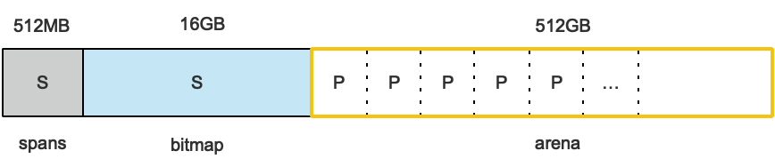
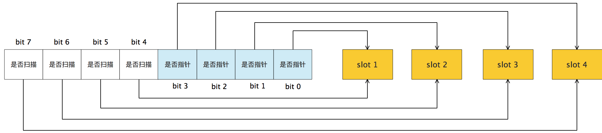
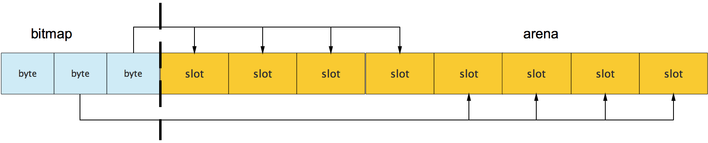

## Q:内存布局

> go中的指针，在32位系统中占用4个字节，在64位系统中占用8字节。

- Go在程序启动的时候，会向操作系统申请一块内存(虚拟地址空间，并不会真正分配内存)，切成小块后自己进行管理。
- 以64位系统为例，三个区域分别是512MB，16GB，512GB



### arena

`arena`区域就是我们通常说的heap，go从heap分配的内存都在这个区域中。

### bitmap

`bitmap区域`标识`arena`区域哪些地址保存了对象。`bitmap`中一个字节对应`arena`区域的四个指针大小的内存。也就是`arena`中每个指针大小的内存都会由`bitmap`的两个bit去表示是否扫描和是否指针。所以`bitmap`区域的大小是`512GB/(4*8B)=16GB`。



bitmap的高地址部分指向arena区域的低地址部分，也就是说bitmap的地址是由高地址向低地址增长的。



### spans

`spans区域`存放`mspan`的指针，每个指针对应一页，所以`spans`区域的大小就是`512GB/8KB*8B=512MB`。8KB饿大小，乘以8字节是因为一个指针8字节。

## Q:内存管理单元

`runtime.mspan` 是 Go 语言内存管理的基本单元(它是一个包含页起始地址、页的 span 规格和页的数量的双端链表)。`src/runtime/mheap.go:mspan`定义了它的数据结构:

```go
type mspan struct {
	next *mspan			//链表后向指针，用于将span链接起来
	prev *mspan			//链表前向指针，用于将span链接起来
	startAddr uintptr // 起始地址，也即所管理页的地址
	npages    uintptr // 管理的页数
	
	nelems uintptr // 块个数，也即有多少个块可供分配

	allocBits  *gcBits //分配位图，每一位代表一个块是否已分配
  gcmarkBits *gcBits // GC回收器的标记位

	allocCount  uint16     // 已分配块的个数
	spanclass   spanClass  // class表中的class ID

	elemsize    uintptr    // class表中的对象大小，也即块大小
}

```

### 跨度类

`runtime.spanClass` 是 `runtime.mspan` 的跨度类，每个class都代表一个固定大小的对象，以及每个span的大小：

> 表中可见最大的对象是32K大小，超过32K大小的由特殊的class表示，该class ID为0，每个class只包含一个对象。

```
// runtime.sizeclasses.go

// class  bytes/obj  bytes/span  objects  waste bytes
//     1          8        8192     1024            0
//     2         16        8192      512            0
//     3         32        8192      256            0
//     4         48        8192      170           32
//     5         64        8192      128            0
//     6         80        8192      102           32
//     7         96        8192       85           32
//     8        112        8192       73           16
//     9        128        8192       64            0
//    10        144        8192       56          128
...
//    66      32768       32768        1            0
```

-  class  : class 的ID，对应mspan结构中的spanclass，表示该span可处理的对象类型。
-  byte/boj：该class代表对象的字节数。
-  bytes/span：每个span占用堆的字节数。是页数 乘以 页的大小。
-  objects: 每个span可分配的对象个数。（bytes/spans）/（bytes/obj）
-  waste bytes: 每个span产生的内存碎片，也即（bytes/spans）%（bytes/obj）

### 示例

以class 10为例，span和管理的内存如下图所示：


spanclass为10，参照class表得出npages=1，nelems=56，elemsize=144。其中startAddr是在span初始化时指定的某个页地址。allocBIts指向位图，代表一个块是否被分配，本例中有两个块已经被分配，其allocCount也为2。

next和prev用于将多个span链接起来，这有利于管理多个span，

## Q:管理组件

Go的内存分配组件`mcache`，` mcentral`，` mheap`组成。

### mcache

```go
// /go/src/runtime/mcache.go
type mcache struct {
	alloc [67*2]*mspan // 按class分组的mspan列表
}
```

- 每个工作线程都会绑定一个`mcache`(M->P->mspan)

- 不存在goroutine竞争的情况，所以不会消耗锁资源。

- mcache包含67*2种mspan。一组列表包含指针(scan)，一组不包含指针(noscan)。这样可以提高GC性能。

- mcache在初始化时候是没有任何span的，在使用过程中会动态的从mcentral中获取并缓存。


### mcentral

```go
//path: /usr/local/go/src/runtime/mcentral.go
type mcentral struct {
	lock      mutex     //互斥锁
	spanclass spanClass // span class ID
	nonempty  mSpanList // non-empty 尚有空闲object的mspan链表
	empty     mSpanList // 没有空闲object的mspan链表，或者是已被mcache取走的msapn链表

	nmalloc uint64      // 已累计分配的对象个数
}
```


- `mcentral`为`mcache`提供切分好的`mspan`资源。每种mcentral保存一种特定大小的全局mspan列表，包括已分配出去的和未分配出去的。
- `mcentral`被所有的工作线程共同享有，存在多个Goroutine竞争的情况，因此会消耗锁资源。

简单说下`mcache`从`mcentral`获取和归还`mspan`的流程：

> 其实就是mcentral中的mspan在nonempty和empty之间移动的过程。

- 获取
  加锁；从`nonempty`链表找到一个可用的`mspan`；并将其从`nonempty`链表删除；将取出的`mspan`加入到`empty`链表；将`mspan`返回给工作线程；解锁。
- 归还
  加锁；将`mspan`从`empty`链表删除；将`mspan`加入到`nonempty`链表；解锁。

### mheap

```go
//path: /usr/local/go/src/runtime/mheap.go

type mheap struct {
	lock mutex
	
	// spans: 指向mspans区域，用于映射mspan和page的关系
	spans []*mspan 
	
	// 指向bitmap首地址，bitmap是从高地址向低地址增长的
	bitmap uintptr 

    // 指示arena区首地址
	arena_start uintptr 
	
	// 指示arena区已使用地址位置
	arena_used  uintptr 
	
	// 指示arena区末地址
	arena_end   uintptr 

	central [67*2]struct {
		mcentral mcentral
		pad [sys.CacheLineSize - unsafe.Sizeof(mcentral{})%sys.CacheLineSize]byte
	}
}
```

- 从数据结构可见，mheap管理着全部的内存，事实上Golang就是通过一个mheap类型的全局变量进行内存管理的。

  

## Q:内存分配流程

Go的内存分配器在分配对象时，根据对象的大小，分成三类：小对象（小于等于16B）、一般对象（大于16B，小于等于32KB）、大对象（大于32KB）。

- (0, 16B) 的对象使用mcache的tiny分配器分配
- [16B, 32KB]的对象，首先计算对象的规格大小，然后使用mcache中相应规格大小的mspan分配。
  - 如果mcache没有相应规格大小的mspan，则向mcentral申请
  - 如果mcentral没有相应规格大小的mspan，则向mheap申请
  - 如果mheap中也没有合适大小的mspan，则向操作系统申请

- (32KB, -) 的对象在mheap上分配。

### 示例：以申请size为n的内存为例，分配步骤如下：

1. 获取当前线程的私有缓存mcache
2. 跟据size计算出适合的class的ID
3. 从mcache的alloc[class]链表中查询可用的span
4. 如果mcache没有可用的span则从mcentral申请一个新的span加入mcache中
5. 如果mcentral中也没有可用的span则从mheap中申请一个新的span加入mcentral
6. 从该span中获取到空闲对象地址并返回


## Reference

[**简单易懂的 Go 内存分配原理解读**](https://yq.aliyun.com/articles/652551)

[源码分析-非常细致](https://www.cnblogs.com/zkweb/p/7880099.html)

[go内存分配可视化指南](https://www.linuxzen.com/go-memory-allocator-visual-guide.html)

