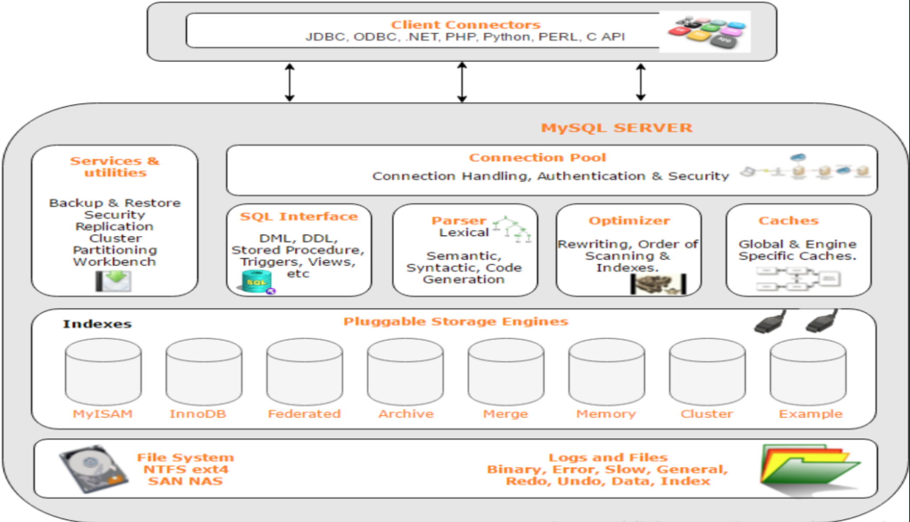

## MySQL架构

和其它数据库相比，MySQL有点与众不同，它的架构可以在多种不同场景中应用并发挥良好作用。主要体现在存储引擎的架构上，**插件式的存储引擎架构将查询处理和其它的系统任务以及数据的存储提取相分离**。这种架构可以根据业务的需求和实际需要选择合适的存储引擎。



- **客户端**：最上层是客户端。
- **连接层**：最上层是一些客户端和连接服务。**主要完成一些类似于连接处理、授权认证、及相关的安全方案**。在该层上引入了线程池的概念，为通过认证安全接入的客户端提供线程。同样在该层上可以实现基于SSL的安全链接。服务器也会为安全接入的每个客户端验证它所具有的操作权限。
- **服务层**：第二层服务层，主要完成大部分的核心服务功能， 包括查询解析、分析、优化、缓存、以及所有的内置函数，所有跨存储引擎的功能也都在这一层实现，包括触发器、存储过程、视图等。
- **引擎层**：第三层存储引擎层，存储引擎真正的负责了MySQL中数据的存储和提取，服务器通过API与存储引擎进行通信。不同的存储引擎具有的功能不同，这样我们可以根据自己的实际需要进行选取。
- **存储层**：第四层为数据存储层，主要是将数据存储在运行于该设备的文件系统之上，并完成与存储引擎的交互

> MySQL 的查询流程具体是？or 一条SQL语句在MySQL中如何执行的？

客户端请求 ---> 连接器（验证用户身份，给予权限）  ---> 查询缓存（存在缓存则直接返回，不存在则执行后续操作） ---> 分析器（对SQL进行词法分析和语法分析操作）  ---> 优化器（主要对执行的sql优化选择最优的执行方案方法）  ---> 执行器（执行时会先看用户是否有执行权限，有才去使用这个引擎提供的接口） ---> 去引擎层获取数据返回（如果开启查询缓存则会缓存查询结果）


## 存储引擎

存储引擎是MySQL的组件，用于处理不同表类型的SQL操作。不同的存储引擎提供不同的存储机制、索引技巧、锁定水平等功能，使用不同的存储引擎，还可以获得特定的功能。

***存储引擎是基于表的，而不是数据库***。使用哪一种引擎可以灵活选择，***一个数据库中多个表可以使用不同引擎以满足各种性能和实际需求***，使用合适的存储引擎，将会提高整个数据库的性能 。

MySQL服务器使用可插拔的存储引擎体系结构，可以从运行中的 MySQL 服务器加载或卸载存储引擎。


#### 查看存储引擎

```mysql
-- 查看支持的存储引擎
SHOW ENGINES

-- 查看默认存储引擎
SHOW VARIABLES LIKE 'storage_engine'

--查看具体某一个表所使用的存储引擎，这个默认存储引擎被修改了！
show create table tablename

--准确查看某个数据库中的某一表所使用的存储引擎
show table status like 'tablename'
show table status from database where name="tablename"
```


#### 设置存储引擎

```mysql
-- 建表时指定存储引擎。默认的就是INNODB，不需要设置
CREATE TABLE t1 (i INT) ENGINE = INNODB;
CREATE TABLE t2 (i INT) ENGINE = CSV;
CREATE TABLE t3 (i INT) ENGINE = MEMORY;

-- 修改存储引擎
ALTER TABLE t ENGINE = InnoDB;

-- 修改默认存储引擎，也可以在配置文件my.cnf中修改默认引擎
SET default_storage_engine=NDBCLUSTER;
```

默认情况下，每当 `CREATE TABLE` 或 `ALTER TABLE` 不能使用默认存储引擎时，都会生成一个警告。为了防止在所需的引擎不可用时出现令人困惑的意外行为，可以启用 `NO_ENGINE_SUBSTITUTION SQL` 模式。如果所需的引擎不可用，则此设置将产生错误而不是警告，并且不会创建或更改表。


#### 存储引擎对比

常见的存储引擎有InnoDB、MyISAM、Memory、NDB。

`InnoDB`是MySQL默认存储引擎，支持事务、行级锁和外键。

#####  文件存储结构对比

在 MySQL中建立任何一张数据表，在其数据目录对应的数据库目录下都有对应表的 `.frm` 文件，`.frm` 文件是用来保存每个数据表的元数据(meta)信息，包括表结构的定义等，与数据库存储引擎无关，也就是任何存储引擎的数据表都必须有`.frm`文件，命名方式为 数据表名.frm，如user.frm。

**查看MySQL 数据保存位置**：`show variables like 'data%'`

**MyISAM 物理文件结构**为：

- `.frm`文件：与表相关的元数据信息都存放在frm文件，包括表结构的定义信息等
- `.MYD` (`MYData`) 文件：MyISAM 存储引擎专用，用于存储MyISAM 表的数据
- `.MYI` (`MYIndex`)文件：MyISAM 存储引擎专用，用于存储MyISAM 表的索引相关信息

**InnoDB 物理文件**结构为：

- `.frm` 文件：与表相关的元数据信息都存放在frm文件，包括表结构的定义信息等

- `.ibd` 文件或 `.ibdata` 文件： 这两种文件都是存放 InnoDB 数据的文件，之所以有两种文件形式存放 InnoDB 的数据，是因为 InnoDB 的数据存储方式能够通过配置来决定是使用**共享表空间**存放存储数据，还是用**独享表空间**存放存储数据。

  独享表空间存储方式使用`.ibd`文件，并且每个表一个`.ibd`文件 共享表空间存储方式使用`.ibdata`文件，所有表共同使用一个`.ibdata`文件（或多个，可自己配置）


## Q:说说MySQL有哪些存储引擎？都有哪些区别？

1. InnoDB 支持**事务**，MyISAM 不支持事务。这是 MySQL 将默认存储引擎从 MyISAM 变成 InnoDB 的重要原因之一；

2. InnoDB 支持**外键**，而 MyISAM 不支持。对一个包含外键的 InnoDB 表转为 MYISAM 会失败；

3. InnoDB 是**聚簇索引**，MyISAM 是**非聚簇索引**。聚簇索引的文件存放在主键索引的叶子节点上，因此 InnoDB 必须要有主键，通过主键索引效率很高。但是辅助索引需要两次查询，先查询到主键，然后再通过主键查询到数据。因此，主键不应该过大，因为主键太大，其他索引也都会很大。而 MyISAM 是非聚集索引，数据文件是分离的，索引保存的是数据文件的指针。主键索引和辅助索引是独立的。

4. InnoDB 不保存表的具体行数，执行`select count(*) from table` 时需要全表扫描。而 MyISAM 用一个变量保存了整个表的行数，执行上述语句时只需要读出该变量即可，速度很快；

5. InnoDB 最小的锁粒度是**行锁**，MyISAM 最小的锁粒度是**表锁**。一个更新语句会锁住整张表，导致其他查询和更新都会被阻塞，因此并发访问受限。这也是 MySQL 将默认存储引擎从 MyISAM 变成 InnoDB 的重要原因之一；

| 对比项   | MyISAM                                                   | InnoDB                                                       |
| -------- | -------------------------------------------------------- | ------------------------------------------------------------ |
| 主外键   | 不支持                                                   | 支持                                                         |
| 事务     | 不支持                                                   | 支持                                                         |
| 行表锁   | 表锁，即使操作一条记录也会锁住整个表，不适合高并发的操作 | 行锁,操作时只锁某一行，不对其它行有影响，适合高并发的操作    |
| 缓存     | 只缓存索引，不缓存真实数据                               | 不仅缓存索引还要缓存真实数据，对内存要求较高，而且内存大小对性能有决定性的影响 |
| 表空间   | 小                                                       | 大                                                           |
| 关注点   | 性能                                                     | 事务                                                         |
| 默认安装 | 是                                                       | 是                                                           |


> 一张表，里面有ID自增主键，当insert了17条记录之后，删除了第15,16,17条记录，再把Mysql重启，再insert一条记录，这条记录的ID是18还是15 ？

如果表的类型是`MyISAM`，那么是18。因为MyISAM表会**把自增主键的最大ID 记录到数据文件中**，重启MySQL自增主键的最大ID也不会丢失；

如果表的类型是`InnoDB`，那么是15。因为InnoDB 表只是**把自增主键的最大ID记录到内存中**(不重启的话效果和MyISAM一样)，所以重启数据库或对表进行OPTION操作，都会导致最大ID丢失。


## Q:哪个存储引擎执行 select count(*) 更快，为什么?

MyISAM更快，因为MyISAM内部维护了一个计数器，可以直接调取。

- 在 MyISAM 存储引擎中，把表的总行数存储在磁盘上，当执行 select count(*) from t 时，直接返回总数据。
- 在 InnoDB 存储引擎中，跟 MyISAM 不一样，没有将总行数存储在磁盘上，当执行 select count(*) from t 时，会先把数据读出来，一行一行的累加，最后返回总数量。

InnoDB 中 count(*) 语句是在执行的时候，全表扫描统计总数量，所以当数据越来越大时，语句就越来越耗时了，为什么 InnoDB 引擎不像 MyISAM 引擎一样，将总行数存储到磁盘上？这跟 InnoDB 的事务特性有关，由于多版本并发控制（MVCC）的原因，InnoDB 表“应该返回多少行”也是不确定的。


## Q:在select count(?) from t 这样的查询语句中，count(*)、count(主键ID)、count(字段)和count(1)等不同用法的性能又那些区别？

count(字段)<count(主键ID)<count(1)~~count(*)

count()是一个聚合函数，对于返回的结果集，一行行地判断，如果count函数的参数不是NULL,累计值加1，否则不加。最后返回累计值。

所以，count(*)、count(主键ID)和count(1)都表示返回满足条件的结果集的总行数；而count(字段),则表示返回满足条件的数据行里面，参数字段不为NULL的总个数。