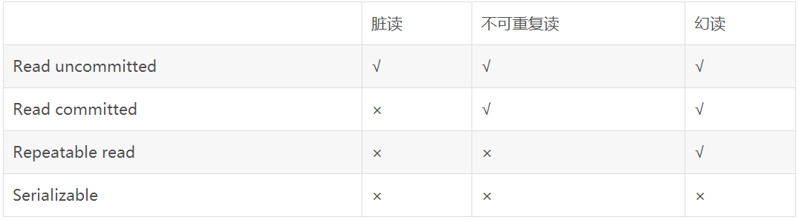
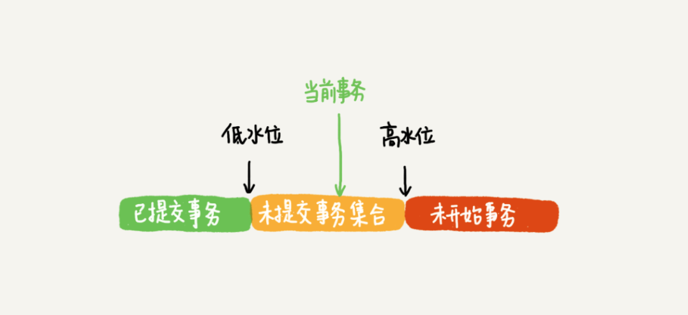

## Q:ACID是什么

- A（Atomicity）原子性：整个事务中的所有操作，要么全部完成，要么全部不完成，不可能停滞在中间某个环节。
- C（Consistency）一致性：在事务开始之前和事务结束以后，数据库的完整性约束没有被破坏。
- I（Isolation）隔离性：并发执行的各个事务之间不能互相干扰。
- D（Durability）持久性：在事务完成以后，该事务所对数据库所作的更改便持久的保存在数据库之中，并不会被回滚。

## Q:什么是脏读、幻读、不可重复读

- 脏读：读取了领一个事务未提交的数据。

- 不可重复度：针对`update`操作。前后多次读取，数据内容不一致。**解决：**使用行级锁，锁定该行，同一时间只能一个事务读取该行。

- 幻读：针对`insert、delete`操作。前后多次读取，数据的总量不一致，有数据无故增加和减少。**解决：**使用表锁。

  

## Q:事务的隔离级别

> 数据库事务的隔离级别有4个，由低到高依次为Read uncommitted 、Read committed 、Repeatable read 、Serializable ，这四个级别可以逐个解决脏读 、不可重复读 、幻读 这几类问题。（对勾表示会产生对应的现象）

- 读未提交（ Read uncommitted）：使用查询语句不会加锁，可能会读到未提交的行。

- 读已提交（Read committed）：只对记录加记录锁，而不会在记录之间加间隙锁，所以允许新的记录插入到被锁定记录的附近，所以再多次使用查询语句时，可能得到不同的结果。

- 可重复读（Repeatable read）：RR隔离级别保证对读取到的数据加锁。它是mysql中默认的隔离级别，可以通过 Next-Key 锁也能够在某种程度上解决幻读的问题。

- 读串行化（Serializable）：

## Q:MVCC（多版本并发控制）是如何实现的

> mysql的innodb采用了MVCC（多版本并发控制）来实现可重复度。

- 可重复读是在**事务开始**的时候生成一个当前事务全局性的快照（读提交则是每次执行语句的时候都重新生成一次快照）
- 事务在开启的时候就会创建快照。每一行记录会有多个版本，每个版本都有自己的**row trx_id**，每条语句更新的时候会产生**回滚日志(undo log)**
- InnoDB 为每个事务构造了一个数组，用来保存这个事务启动瞬间，当前正在“活跃”的所有事务 ID。“活跃”指的就是，启动了但还没提交。数组里面事务 ID 的最小值记为低水位，当前系统里面已经创建过的事务 ID 的最大值加 1 记为高水位。这个视图数组和高水位，就组成了当前事务的一致性视图（read-view）。
- 快照遵循如下规则
  - 版本未提交，不可见；
  - 版本已提交，但是是在视图创建后提交的，不可见；
  - 版本已提交，而且是在视图创建前提交的，可见。

### 并发写问题

> 两个事务，对同一条数据做修改。

- 数据的更新都是先读后写，这个读称为**当前读**，当前读会加行锁，必须等其他的锁释放。
- 加锁要分有索引和无索引的两种情况。
  - 有索引:对定位到的数据加锁；
  - 无索引：mysql无法直接定位到数据，会对这张表中所有的数据加行锁，接着过滤一遍，最终留下符合条件的锁。（先全部加锁再过滤的操作比较影响性能）

### 解决幻读问题

> 实际上在 MySQL 中并不会出现，MySQL 已经在可重复读隔离级别下解决了幻读的问题

- 行锁防止别的事务修改或删除，GAP锁防止别的事务新增，行锁和GAP锁结合形成的的Next-Key锁共同解决了RR级别在写数据时的幻读问题。

## Q:Mysql 中事务是如何实现的

### redo log

- 重做日志，用来实现**事务的持久性**。日志由重做日志缓冲区（redo log buffer）和重做日志文件（redo log file）,前者是在内存中，后者是在磁盘中。
- redo log作用：把随机IO变成了顺序IO，也就是WAL（write ahead log）技术。因为如果每次的数据更新(包含未提交事务)都写入磁盘，那么磁盘需要先找到数据再更新，整个过程IO、查询成本很高。

#### 引入原因

- Innodb为了提高数据的读写效率，引入了Buffer Poll作为数据库的缓冲。当从数据库读取数据时，会首先从Buffer Pool中读取，如果Buffer Pool中没有，则从磁盘读取后放入Buffer Pool；当向数据库写入数据时，会首先写入Buffer Pool，Buffer Pool中修改的数据会定期刷新到磁盘中（这一过程称为刷脏）。
- Buffer Pool的使用大大提高了读写数据的效率，但是也带了新的问题：如果MySQL宕机，而此时Buffer Pool中修改的数据还没有刷新到磁盘，就会导致数据的丢失，事务的持久性无法保证。

#### 引入之后的操作

当数据修改时，除了修改Buffer Pool中的数据，还会在redo log记录这次操作；当事务提交时，会调用fsync接口对redo log进行刷盘。如果MySQL宕机，重启时可以读取redo log中的数据，对数据库进行恢复。redo log采用的是WAL（Write-ahead logging，预写式日志），所有修改**先写入日志，再更新到Buffer Pool**，保证了数据不会因MySQL宕机而丢失，从而满足了持久性要求。

#### redo log 与bin log的区别

- 作用不同：redo log是用于crash recovery的，保证MySQL宕机也不会影响事务持久性；binlog是用于point-in-time recovery的，保证服务器可以基于时间点恢复数据，此外binlog还用于主从复制。
- 层次不同：redo log是InnoDB存储引擎实现的，而binlog是MySQL的服务器层实现的，同时支持InnoDB和其他存储引擎。
- 内容不同：redo log是物理日志，内容基于磁盘的Page；binlog的内容是二进制的，根据binlog_format参数的不同，可能基于sql语句、基于数据本身或者二者的混合。

#### binlog为什么没有crash_safe的能力

当数据库 crash 后，想要恢复**未刷盘但已经写入 redo log 和 binlog 的数据**到内存时，binlog 是无法恢复的。

虽然 binlog 拥有全量的日志，但**没有一个标志让 innoDB 判断哪些数据已经刷盘，哪些数据还没有**。

### undo log

- undo log是用来回滚数据的用于保障 未提交事务的原子性

## Reference

[Innodb中事务隔离级别和锁的关系](https://app.yinxiang.com/shard/s43/nl/13675070/a39e2dcc-4280-4017-9ef4-1457ff182c21)

[事务隔离级别和实现原理](https://app.yinxiang.com/shard/s43/nl/13675070/95fa2250-bf74-4d1c-b1bd-465ebfafe1e8)

[Innodb 的redo log 、bin log作用](https://app.yinxiang.com/shard/s43/nl/13675070/b3ce3b2b-1f83-4dd0-9d74-1500cb1c7ac6)

