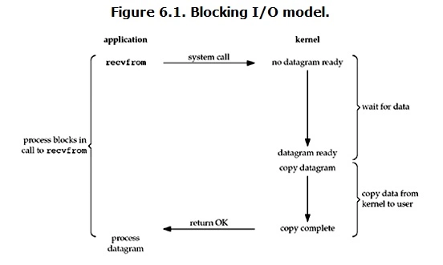
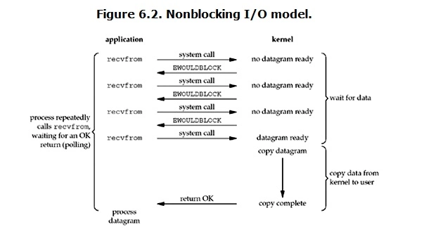
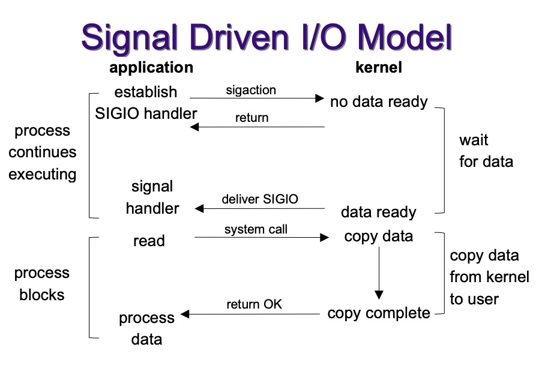
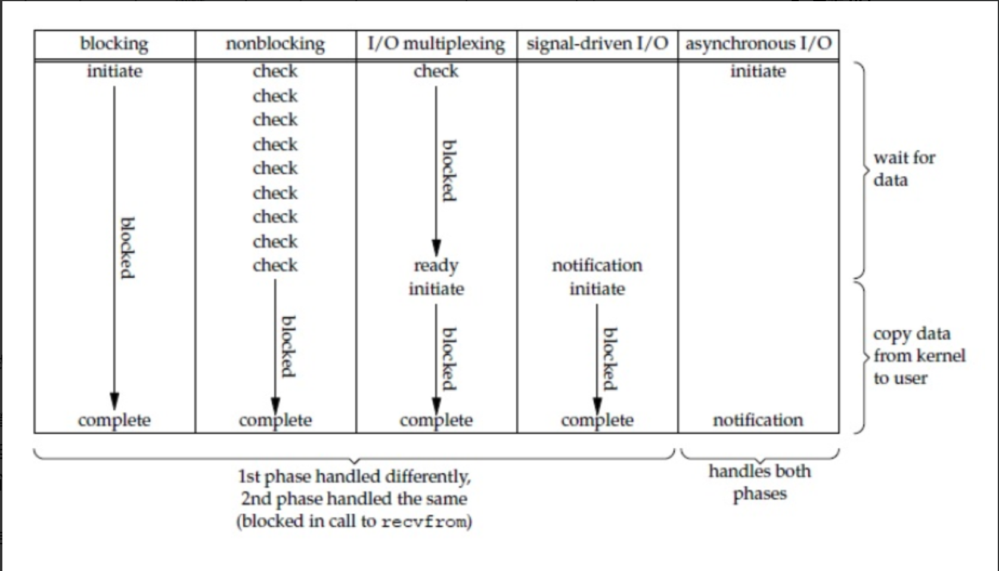

##  Q:Linux的五种IO模型

> 个人理解IO操作分两部分。执行系统调用后数据准备；数据准备完成之后拷贝到用户态。
>
> 阻塞式和非阻塞式最大的区别就是阻塞式在等待数据阶段会进入阻塞，而非阻塞式不会。
>
> 同步IO(包括BIO、NIO、IO multiplexing)和异步IO的最大区别是：异步IO在整个过程中并没有阻塞。

### 阻塞IO(Blocking I/O)

- 对一个文件描述符操作(FD)时，如果操作没有响应就会一直等待，直到内核有反馈。
- 缺点：单线程一次只能操作一个FD。

### 非阻塞IO(Nonblocking I/O)

- 对FD操作时，如果内核没反馈不会一直等待。非阻塞I/O会将所有FD放入FD set，一直轮询所有FD，直到有反馈。
- 缺点：每次轮询没有时间的FD也会被操作，浪费CPU。

### 信号驱动I/O(Signal Driven I/O)

- 信号驱动IO是首先注册signal handler,当有时间到来时，内核会向进程发送信号，然后应用进程执行signal handler
- 缺点：编程难度高，信号处理复杂。

### 异步I/O(Asynchronous I/O)

- 信号驱动I/O是FD满足条件时内核通知应用程序可以开始I/O了，而异步I/O是应用程序将I/O操作交给内核，当内核做完之后再通知应用程序I/O完成。
- 缺点：并发量不好控制。

### IO多路复用(I/O Multiplexing)

- IO多路复用，重点是，应用层可以把多个socket连接注册给操作系统，让操作系统帮忙盯着这些socket有没有数据过来（可读/可写），注册完成之后，应用层就可以去干别的事了。当socket有数据过来时，操作系统会通知应用层，应用层再去处理。这样的优势在于应用层1个线程，就可以服务多个网络请求。
- 

### 比较

## Q:IO多路复用

### select

- select使用BitsMap来传入和接受FD，每次调用都会在用户空间和内核空间之间拷贝。
- select的BitsMap限制只能监听FD 0~1023。
- 轮询的方式监听所有FD，𝑂(𝑛)的复杂度。
- select 的 timeout 精度为 1ns，而其他两种为 1ms
- 可移植性好

#### 工作方式

> 需要进行 2 次「遍历」文件描述符集合，一次是在内核态里，一个次是在用户态里 ，而且还会发生 2 次「拷贝」文件描述符集合，先从用户空间传入内核空间，由内核修改后，再传出到用户空间中。

- 将已连接的Socket放到一个`文件描述符集合`，然后调用select函数将文件描述符集合`拷贝`到内核里。
- 内核通过`遍历`we年描述符集合的方式检查是否有网络事件产生。
- 当检查到有事件产生后，将此Socket标记为可读或可写。把整个文件描述符集合拷贝回用户态。
- 用户态再遍历的方法找到可读或可写的Socket，然后进行处理。

### poll

- poll和select的区别就是BitsMap换成了链表，FD数量只受poll可用内核内存大小限制。

- 轮询的方式监听所有FD，𝑂(𝑛)的复杂度。

  

### epoll

- epoll只有在epoll-ctl(ADD)时将数据拷入，epoll_wait时再将数据拷出，多次复用没有其他数据拷贝，节省了数据拷贝。
- 时间复杂度为O(logn)

#### 工作方式

-  epoll在内核里使用**红黑树来跟踪所有待检测的文件描述符**，把需要监控的sokcet通过`epoll_ctl()`函数加入内核中的红黑树里。
-  epoll使用时间驱动的机制，内核里**维护了一个链表来记录就绪事件**，当某个socket有事件发生时，通过回调函数内核会将其加入到这个就绪事件列表中，当用户调用`epoll_wait()`时，返回有时间发生的文件描述符个数。

#### 触发模式

- **边缘触发（edge-triggered，ET）：**当被监控的 Socket 描述符上有可读事件发生时，服务器只会从epoll_wait中苏醒一次。一般和非阻塞IO搭配使用。
- **水平触发（level-triggered，LT）：**当被监控的 Socket 描述符上有可读事件发生时。服务器端不断地从epoll_wait中苏醒，直到内核缓冲区数据被read函数读完才结束。

[IO复用 各自的应用场景](https://juejin.cn/post/6844903810322661390)
[Linux IO多路复用机制](https://journey-c.github.io/io-multiplexing/)

[一次搞定网络IO](https://mp.weixin.qq.com/s/Qpa0qXxuIM8jrBqDaXmVNA)

[操作系统IO](https://hadyang.github.io/interview/docs/basic/os/io/)

