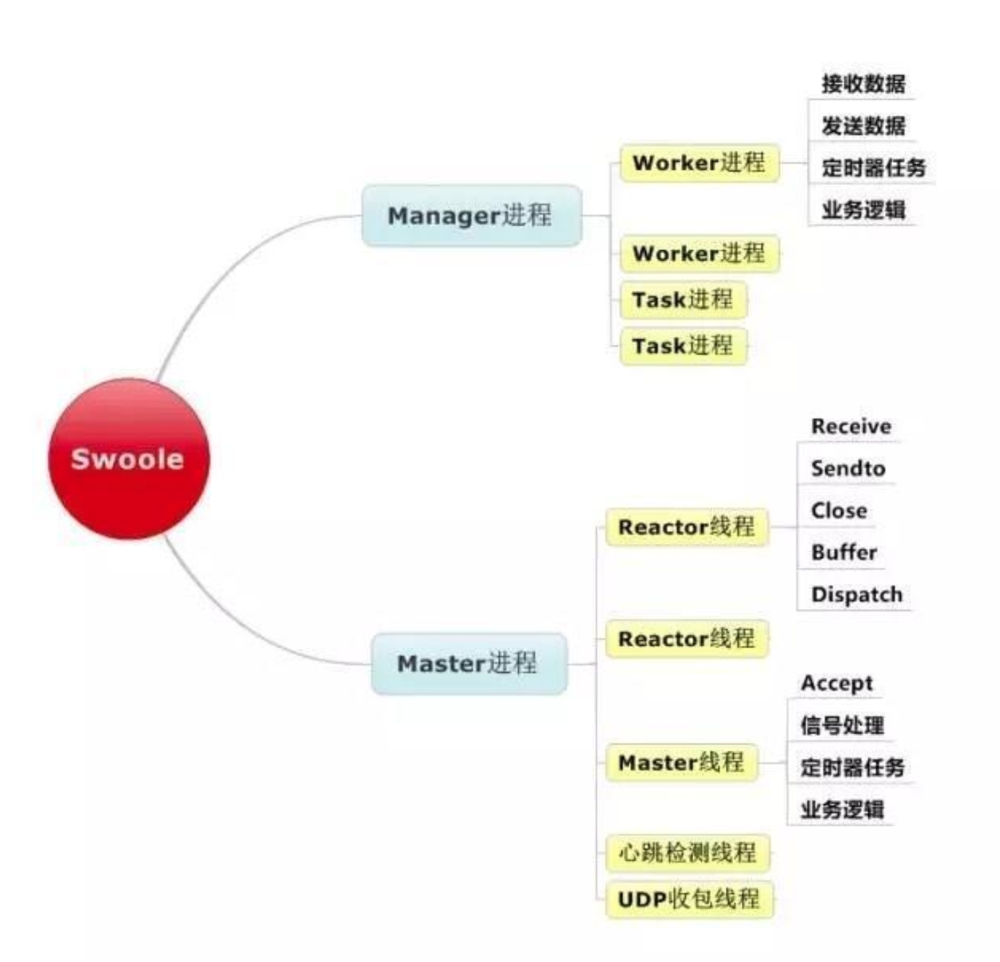
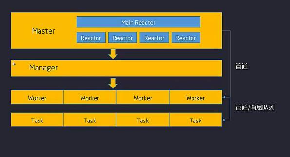

## Q:PHP-FPM缺点

- php-fpm 性能不佳，并发性能不好。
- 核心异步网络不支持。

## Swoole介绍

- swoole提供了PHP语言的异步多线程服务器，异步TCP/UDP网络客户端，异步MySQL，异步Redis， 数据库连接池，AsyncTask，消息队列，毫秒定时器，异步文件读写，异步DNS查询。 Swoole还内置了Http/WebSocket服务器端/客户端、Http2.0服务器端。
- Swoole底层内置了异步非阻塞、多线程的网络IO服务器。Swoole既支持全异步，也支持同步。

## Q:Swoole 如何处理高并发？

- swoole采用的架构模式：多线程Reactor+多进程Worker。
- Reactor是基于epoll的，负责监听客户端变化。
- worker处理客户端的请求，处理完毕通过进程间通讯(管道、共享内存、消息队列)发送给对应的reactor。
- reactor将相应结果发送给相应的连接。

#### Swoole 如何实现异步IO?

- Swoole的worker进程有2种类型：一种是普通的worker进程，一种是task worker进程。

- **worker进程：**用来处理普通的耗时不是太长的请求。
- **task worker进程**：用来处理耗时较长的请求，比如数据库的I/O操作我们再以异步MySQL举例，不难看出通过worker、task worker结合的方式，我们就实现了异步I/O。

[Swoole 如何实现高并发 、 异步IO](https://app.yinxiang.com/shard/s43/nl/13675070/816fb41f-814a-41a7-bd0f-346e2988aa6b)

