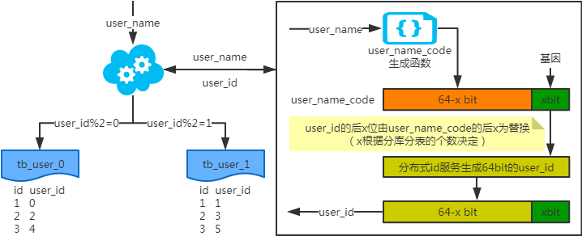
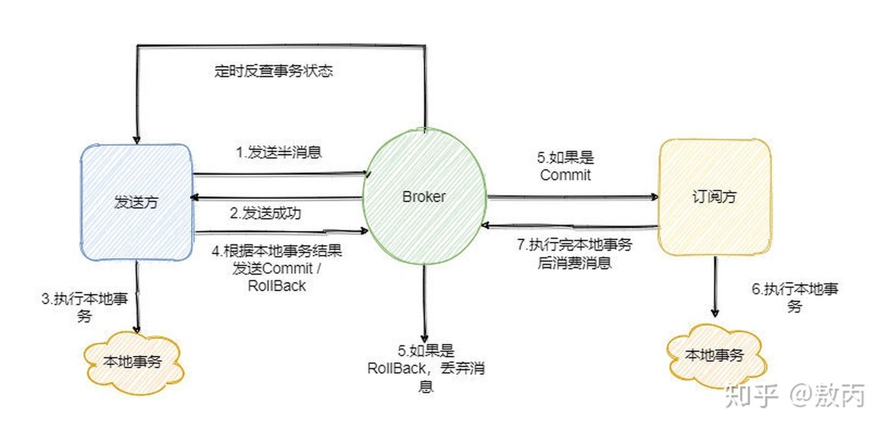

# 分布式服务

## Q:多数据库场景要考虑的问题

- 如果是基于性能的考虑，并发量大，**读多写少**的场景。可以采用一主多从，主库负责写，以及引入缓存机制来提高数据的实时性。
- 如果是基于性能的考虑，并发量大，**写多读少**的场景。如果读的**实时要求不高**，可以考虑采用队列的形式，后台线程负责写入数据库。
- 如果是基于业务的拆分，要搞明白是不是需要拆分？这个要慎重，优先考虑将业务的表空间分到不同的磁盘，避免单磁盘的写入，可以提高一定的数据写入效率。在这个过程中还需要考虑数据库各种缓存的大小设定，比如chang buffer，redolog文件。争取做到单点优化做到无突破，再考虑横向或者纵向的扩展。


## Q:分库分表

> 并非所有表都需要水平拆分，要看增长的类型和速度，水平拆分是大招，拆分后会增加开发的复杂度，不到万不得已不使用。
>
> 在大规模并发的业务上，尽量做到在线查询和离线查询隔离，交易查询和运营/客服查询隔离。
>
> 拆分维度的选择很重要，要尽可能在解决拆分前问题的基础上，便于开发。
>
> 数据库没你想象的那么坚强，需要保护，尽量使用简单的、良好索引的查询，这样数据库整体可控，也易于长期容量规划以及水平扩展。

### 1、为什么分库分表

不管是IO瓶颈，还是CPU瓶颈，最终都会导致数据库的活跃连接数增加，进而逼近甚至达到数据库可承载活跃连接数的阈值。在业务Service来看就是，可用数据库连接少甚至无连接可用。接下来就可以想象了吧（并发量、吞吐量、崩溃）。

#### IO瓶颈

第一种：磁盘读IO瓶颈，热点数据太多，数据库缓存放不下，每次查询时会产生大量的IO，降低查询速度 -> 分库和垂直分表。

第二种：网络IO瓶颈，请求的数据太多，网络带宽不够 -> 分库。

#### CPU瓶颈

第一种：SQL问题，如SQL中包含join，group by，order by，非索引字段条件查询等，增加CPU运算的操作 -> SQL优化，建立合适的索引，在业务Service层进行业务计算。

### 切分策略

#### Hash切分

数据水平切分后我们希望是一劳永逸或者是**易于水平扩展**的，所以推荐采用mod 2^n这种一致性Hash。

以统一订单库为例，我们分库分表的方案是32*32的，即通过UserId后四位mod 32分到32个库中(UID%32)，同时再将UserId后四位Div 32 Mod 32将每个库分为32个表(UID/32%32)，共计分为1024张表。线上部署情况为8个集群(主从)，每个集群4个库。

### 中间件选型

#### Cobar

- 

#### MyCat

- 基于阿里Cobar，社区维护。以及分表分库、容灾管理，而且可以用于多租户应用开发、云平台基础设施，让你的架构具备很强的适应性和灵活性。
- 后端由BIO改为NIO，并发量有大幅提高； 增加了对Order By, Group By, Limit等聚合功能。

#### DRDS

- 基于阿里Cobar，实现了对分布式Join支持，SUM/MAX/COUNT/AVG等聚合函数支持以及排序等函数支持，对应用程序屏蔽各种复杂的底层DB拓扑结构，获得单机数据库一样的使用体验。


### 分库分表带来的问题

#### 1、只有一个非partition key作为查询条件

- 映射法（单独建立映射表）：

  - **映射表**使用索引覆盖查询，速度快；
  - **分布式缓存映射**，比表快，不过要保证高可用，不要被穿透，为了绝对可靠可以表和缓存联用。（在1：1时比较合适）

- 基因法

  - 非分区key融入到分区key中的一部分。例如：根据user_name查询时，先通过user_name_code生成函数生成user_name_code再对其取模路由到对应的分库或分表。id生成常用snowflake算法。

    

    

#### 2、不止一个非partition key作为查询条件

- 映射法：同上。
- 冗余法：服务同步双写或者服务异步双写。保证最终一致性。

#### 3、后台除了partition key还有各种非partition key组合条件查询

- NoSQL：使用ES、HBASE等 
- 冗余法：服务同步双写或者服务异步双写。保证最终一致性。


### 数据迁移(一般是订单表以新增为主)

- 第一阶段：导入历史数据，数据库双写（事务成功以老数据源为准），查询走老数据源，通过定时任务补全新老差异数据。
- 第二阶段：新老数据无差异，依旧双写（事务成功以新数据源为准），查询走新数据源，通过任务补齐新旧数据。
- 第三阶段：稳定运行无误后，下线老数据源，通过异步任务更新老数据。如果有其他业务或者服务依赖老数据，建议使用数仓。也可在数仓建设完善后废除老数据。


## Q:分布式ID

### uuid

- 优点：性能非常高，本地生成，没有网络消耗
- 缺点：
  - 不易存储，通常以36长度的字符串表示。
  - 信息不安全，基于MAC地址生成UUID的算法可能会造成MAC地址泄露。
  - 如果作为数据库主键，在InnoDB引擎下，UUID的无序性可能会引起数据位置频繁变动，严重影响性能。

### 数据库自增ID

- 优点：实现简单，ID号单调自增。

- 缺点：

  - 强依赖DB，当DB异常时整个系统不可用，属于致命问题。配置主从复制可以尽可能的增加可用性，但是数据一致性在特殊情况下难以保证。主从切换时的不一致可能会导致重复发号。
  - ID发号性能瓶颈限制在单台MySQL的读写性能。


### 固定步长数据库自增ID

- 缺点：
  - 系统扩展困难
  - ID没有了单调递增的特性，只能趋势递增，这个缺点对于一般业务需求不是很重要，可以容忍。
  - 数据库压力还是很大，每次获取ID都得读写一次数据库，只能靠堆机器来提高性能。

### leaf-segment数据库方案

> 对每个服务设置一个区段，应用服务器每次从数据库获取区段并保存在本地缓存。待消耗完之后再次获取一个区段。

```mysql
+-------------+--------------+------+-----+-------------------+-----------------------------+
| Field       | Type         | Null | Key | Default           | Extra                       |
+-------------+--------------+------+-----+-------------------+-----------------------------+
| biz_tag     | varchar(128) | NO   | PRI |                   |                             |
| max_id      | bigint(20)   | NO   |     | 1                 |                             |
| step        | int(11)      | NO   |     | NULL              |                             |
| desc        | varchar(256) | YES  |     | NULL              |                             |
| update_time | timestamp    | NO   |     | CURRENT_TIMESTAMP | on update CURRENT_TIMESTAMP |
+-------------+--------------+------+-----+-------------------+-----------------------------+
```

biz_tag用来区分业务，max_id表示该biz_tag目前所被分配的ID号段的最大值，step表示每次分配的号段长度。原来获取ID每次都需要写数据库，现在只需要把step设置得足够大，比如1000。那么只有当1000个号被消耗完了之后才会去重新读写一次数据库。读写数据库的频率从1减小到了1/step，大致架构如下图所示：


优点：

- Leaf服务可以很方便的线性扩展，性能完全能够支撑大多数业务场景。
- ID号码是趋势递增的8byte的64位数字，满足上述数据库存储的主键要求。
- 容灾性高：Leaf服务内部有号段缓存，即使DB宕机，短时间内Leaf仍能正常对外提供服务。
- 可以自定义max_id的大小，非常方便业务从原有的ID方式上迁移过来。

缺点：

- ID号码不够随机，能够泄露发号数量的信息，不太安全。
- TP999数据波动大，当号段使用完之后还是会hang在更新数据库的I/O上，tg999数据会出现偶尔的尖刺。
- DB宕机会造成整个系统不可用（解决方案：主从高可用）。

### leaf-segment数据库 双buff方案

> 主要解决数据库IO性能问题。具体做法是在本地维护两个leaf，当使用10%号段时切换下一个buff。

采用双buffer的方式，Leaf服务内部有两个号段缓存区segment。当前号段已下发10%时，如果下一个号段未更新，则另启一个更新线程去更新下一个号段。当前号段全部下发完后，如果下个号段准备好了则切换到下个号段为当前segment接着下发，循环往复。


### snowflake算法

- 1 bit：不用。因为二进制里第一个 bit 为如果是 1，那么都是负数，但是我们生成的 id 都是正数，所以第一个 bit 统一都是 0。
- 41 bit：表示的是时间戳，单位是毫秒。41 bit 可以表示的数字多达 `2^41 - 1`，也就是可以标识 `2^41 - 1` 个毫秒值，换算成年就是表示69年的时间。
- 10 bit- workID：记录工作机器 id，代表的是这个服务最多可以部署在 2^10台机器上哪，也就是1024台机器。但是 10 bit 里 5 个 bit 代表机房 id，5 个 bit 代表机器 id。意思就是最多代表 `2^5`个机房（32个机房），每个机房里可以代表 `2^5` 个机器（32台机器）。
- 12 bit-序列号：这个是用来记录同一个毫秒内产生的不同 id，12 bit 可以代表的最大正整数是 `2^12 - 1 = 4096`，也就是说可以用这个 12 bit 代表的数字来区分**同一个毫秒内**的 4096 个不同的 id。
- 缺点：强依赖机器时钟。

#### workID生成方案

对于workerID的分配，当服务集群数量较小的情况下，完全可以手动配置。Leaf服务规模较大，动手配置成本太高。所以使用Zookeeper持久顺序节点的特性自动对snowflake节点配置wokerID。

#### 弱化zk的依赖

除了每次会去ZK拿数据以外，也会**在本机文件系统上缓存一个workerID文件**。当ZooKeeper出现问题，恰好机器出现问题需要重启时，能保证服务能够正常启动。这样做到了对三方组件的弱依赖。一定程度上提高了SLA

#### 解决时钟问题

> 周期性上传本地时间到zk的临时节点，并获取所有机器节点下的IP Port通过RPC获取对应机器时间比较，若abs( 系统时间-sum(time)/nodeSize ) < 阈值，则认为系统时间准确。


## Q: 分布式锁

### Redis 分布式锁-SETNX

#### 加锁：

```redis
SET resource_name my_random_value NX PX 30000
```

- 锁的过期时间要提前评估好，要大于操作共享资源的时间。

#### 释放锁

防止出现某个服务或者线程超时的问题，在设置value的时候加入自己的一些唯一信息(比如数据ID)，删除的时候要先比较value，再删除

```lua
-- 删除锁的时候，找到 key 对应的 value，跟自己传过去的 value 做比较，如果是一样的才删除。
if redis.call("get",KEYS[1]) == ARGV[1] then
    return redis.call("del",KEYS[1])
else
    return 0
end
```


#### 存在的问题
- 超时解锁导致并发问题，
  - 解决方案：为获得锁的线程增加守护线程，将要过期的时候进行续期。
- 在主从架构下可能会存在主节点挂掉时，从节点变主。出现两个客户端同时获得锁。
- 主从架构下脑裂(因为网络问题，同时存在两个主节点)。两个客户端同时获得锁。

### Redis 分布式锁 - Redlock

> 为了解决Redis单点问题，redis的作者提出了**RedLock**算法。

#### 加锁过程：

- 客户端获取当前时间
- 客户端顺序依次向N个Redis实例执行加锁的操作。加锁的超时时间要远小于锁的过期时间，一般设置几十毫秒。
- 当在大多数节点建立锁（大于等于N/2+1），并且获取锁的总耗时没有超过超时时间，则认为获取锁成功。
- 获取成功后锁的有效时间要重新计算
- 要是建立锁失败，需要依次删除之前的锁

#### 缺点

- 使用 Redlock 时要避免机器时钟发生跳跃，可能会存在两个客户端同时获取锁的情况。

### ZK分布式锁

#### 单节点监听

#### 多节点顺序获取

### redis 分布式锁和 zk 分布式锁的对比

- redis 分布式锁，其实**需要自己不断去尝试获取锁**，比较消耗性能。
- zk 分布式锁，获取不到锁，注册个监听器即可，不需要不断主动尝试获取锁。
- zk的分布式锁比较适合分布式任务调度场景，不适合高频次持锁时间短的场景。


## Q:分布式事务

### 两阶段提交（2PC/XA）

> 中间件的全局二级索引就是使用XA实现。

#### 实现

- 一个**事务管理器**协调多个数据库资源。
- 第一阶段(prepare)：事务管理器先问各个数据库是否准备就绪。第二阶段：正式提交事务。
- 第一阶段如果超时或者有未就绪情况出现，在第二阶段就会提交回滚。第二阶段的操作只能重试。

#### 优点

实时强一致性。

#### 缺点

- **同步阻塞**的，而同步阻塞就导致长久的资源锁定问题，其他事务参与者就只能阻塞等待资源释放，处于阻塞状态。**总体而言效率低**。
- 存在**单点故障**问题。一旦事务管理器出现故障，整个系统不可用。

### TCC方案

> 2PC 和 3PC 都是数据库层面的，而 TCC 是业务层面的分布式事务
>
> TCC 的全称是：`Try`、`Confirm`、`Cancel`。

#### 实现

- Try 阶段：这个阶段说的是对各个服务的资源做检测以及对资源进行**锁定或者预留**。

- Confirm 阶段：这个阶段说的是在各个服务中**执行实际的操作**。

- Cancel 阶段：如果任何一个服务的业务方法执行出错，那么这里就需要**进行补偿**，就是执行已经执行成功的业务逻辑的回滚操作。（把那些执行成功的回滚）

#### 优点

- 强一致性

#### 缺点

- 代码开发量巨大
- **对业务的侵入和耦合性较高**，需要根据特定的场景和业务逻辑来设计相应的操作。

  

### 本地消息表

#### 实现

- 在本地数据库中有一张**消息表**(消息表要有消息状态)，然后在执行业务的时候 **将业务的执行和将消息放入消息表中的操作放在同一个事务中**，这样就能保证消息放入本地表中业务肯定是执行成功的。
- 通过单独的服务轮询表中的数据去处理(拉取太猛了DB有压力，可以用Cannal订阅，实时流式消费数据），处理成功更新表中数据的状态。
- 有可能消息对应的操作不成功，因此也需要重试，重试就得保证对应服务的方法是幂等的，而且一般重试会有最大次数，超过最大次数可以记录下报警让人工处理。

#### 缺点

- 可能存在数据暂时不一致情况


### 消息事务

- 第一步先给 Broker 发送事务消息即半消息，**半消息不是说一半消息，而是这个消息对消费者来说不可见**，然后**发送成功后发送方再执行本地事务**。
- 消息的发送方需要提供反查事务接口。
- 订阅方如果事务失败，可以不断重试、通知发送方回滚、人工介入等



### 最大努力通知

- 系统 A 本地事务执行完之后，发送个消息到 MQ；

- 这里会有个专门消费 MQ 的**最大努力通知服务**，这个服务会消费 MQ 然后写入数据库中记录下来，或者是放入个内存队列也可以，接着调用系统 B 的接口；

- 要是系统 B 执行成功就 ok 了；要是系统 B 执行失败了，那么最大努力通知服务就定时尝试重新调用系统 B，反复 N 次，最后还是不行就放弃。

## Q:分布式缓存


## Q:CAP是什么

- 一致性(Consistency)
- 可用性(Availability)
- 分区容错(Partition tolerance)


#### CAP三个特性只能满足其中两个，那么取舍的策略就共有三种：

- CA
  - 如果不要求P（不允许分区），则C（强一致性）和A（可用性）是可以保证的。但放弃P的同时也就意味着放弃了系统的扩展性，也就是分布式节点受限，没办法部署子节点，这是违背分布式系统设计的初衷的。传统的关系型数据库RDBMS：Oracle、MySQL就是CA。
- CP
  - 如果不要求A（可用），相当于每个请求都需要在服务器之间保持强一致，而P（分区）会导致同步时间无限延长(也就是等待数据同步完才能正常访问服务)，一旦发生网络故障或者消息丢失等情况，就要牺牲用户的体验。等待所有数据全部一致了之后再让用户访问系统。
  - 最典型的就是分布式数据库，如Redis、HBase等。
- AP
  - 要高可用并允许分区，则需放弃一致性。
  - 例如缓存数据的更新。


## Q: BASE是什么？

- BASE是对CAP中一致性和可用性权衡的结果，其核心思想是即使无法做到强一致性（Strong consistency），但每个应用都可以根据自身的业务特点，采用适当的方式来使系统达到最终一致性（Eventual consistency）。
- **基本可用(Basically Available)： **有不可预知故障时，允许损失部分可用性。例如：响应时间增长、降级。
- **软状态(Soft State)：** 允许系统中的数据存在中间状态。
- **最终一致性(Eventually consistent)：** 系统中所有的数据副本，在经过一段时间的同步后，最终能够达到一个一致的状态。


### ACID和BASE的区别与联系

ACID是传统数据库常用的设计理念，追求强一致性模型。BASE支持的是大型分布式系统，提出通过牺牲强一致性获得高可用性。

ACID和BASE代表了两种截然相反的设计哲学。

在分布式系统设计的场景中，系统组件对一致性要求是不同的，因此ACID和BASE又会结合使用。


## Reference

[分库分表理由和常见方案](https://app.yinxiang.com/shard/s43/nl/13675070/8e8f67c8-e0d3-48bb-912d-4e4265ee62fe)

[大众点评的分库分表实践](https://app.yinxiang.com/shard/s43/nl/13675070/d40ea67a-ad65-4e8e-adb1-8cb7cd5396d8)

[分布式ID - 美团 leaf - 分布式ID生成系统](https://app.yinxiang.com/shard/s43/nl/13675070/f00e727b-d601-40ef-bf69-811a1c902271)

[基于redis的分布式安全吗 非常详细的解释](https://app.yinxiang.com/shard/s43/nl/13675070/2fea100f-5d24-44e6-8f93-33657ed9a366)

[分布式事务 -小米团队](https://app.yinxiang.com/shard/s43/nl/13675070/463878f9-07b9-4a64-abf4-84e4cae4697c)

[分布式事务解决方案6种](https://app.yinxiang.com/shard/s43/nl/13675070/62a0291c-5d85-493d-919c-d205328a6ffd)

