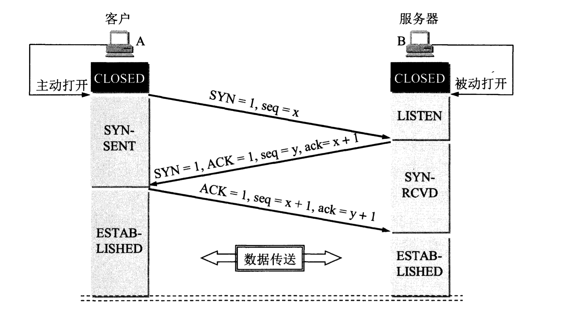
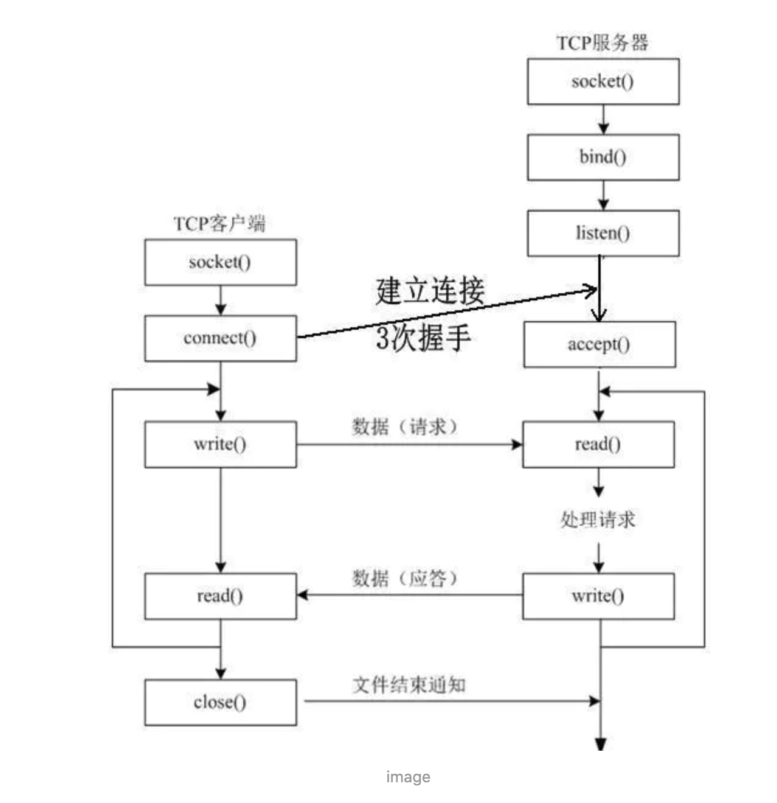
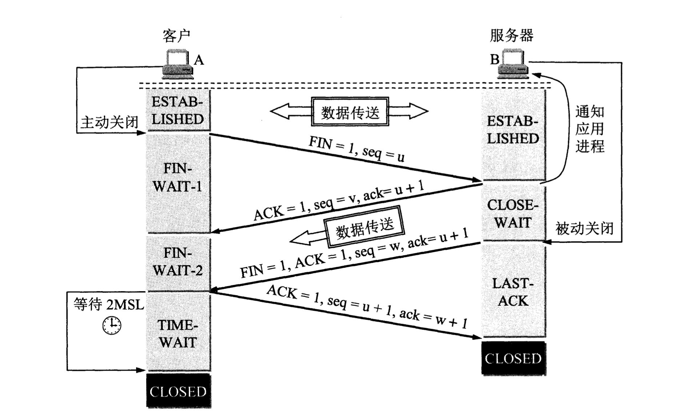
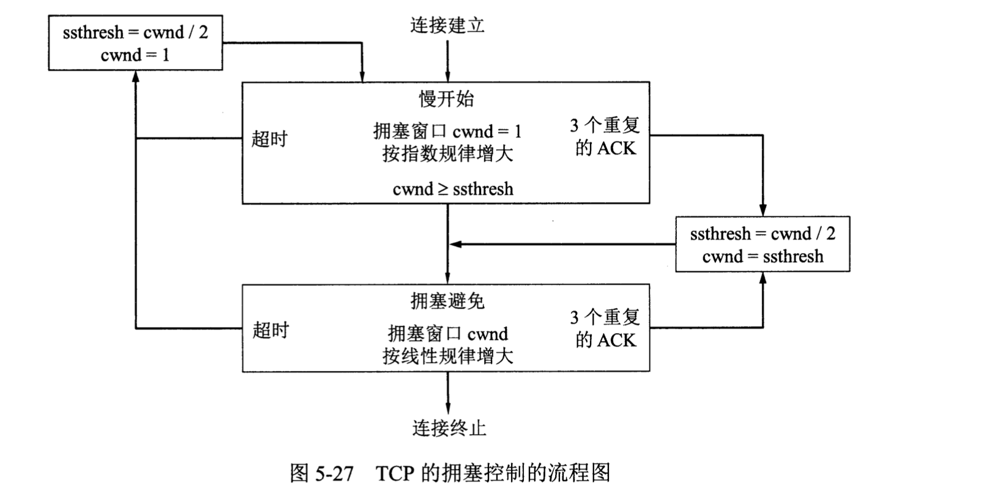
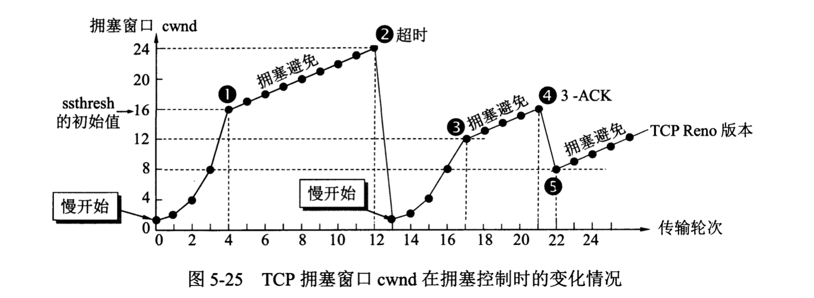

## Q: TCP 端口号的分类

> TCP：21-FTP，23-Telnet，25-SMTP，

### 服务端使用的端口

####  熟知端口号

- 取值范围：0 - 1023

- 常见的端口号

| 应用程序   | FTP    | TELNET | SMTP | DNS  | TFTP | HTTP   | HTTPS   | SNMP |
| ---------- | ------ | ------ | ---- | ---- | ---- | ------ | ------- | ---- |
| 熟知端口号 | **21** | 23     | 25   | 53   | 69   | **80** | **443** | 161  |

#### 登记端口号

- 取值范围：1024 - 49151
- 这类端口没有熟知的应用程序使用，但是需要在IANA按照规定的手续登记，以防重复。49151是65535的四分之三。

### 客户端使用的端口号

- 取值范围：49152 - 65535
- 这类端口仅在客户端进程运行时才动态选择。

## Q:TCP和UDP的区别

- TCP是面向连接的，UDP是无连接的；

- TCP是可靠的，UDP是不可靠的；

- TCP只支持点对点通信，UDP支持一对一、一对多、多对一、多对多的通信模式；

- TCP是面向字节流的，UDP是面向报文的；

- TCP有拥塞控制机制;UDP没有拥塞控制，适合媒体通信

- TCP首部开销(20个字节)比UDP的首部开销(8个字节)要大；

 

#### UDP的主要特点：

1. UDP是无连接的；
2. UDP使用尽最大努力交付，即不保证可靠交付，因此主机不需要维持复杂的链接状态（这里面有许多参数）；
3. UDP是面向报文的；
4. UDP没有拥塞控制，因此网络出现拥塞不会使源主机的发送速率降低（对实时应用很有用，如IP电话，实时视频会议等）；
5. UDP支持一对一、一对多、多对一和多对多的交互通信；
6. UDP的首部开销小，只有8个字节，比TCP的20个字节的首部要短。

#### TCP的主要特点：

1. **TCP是面向连接的**。（就好像打电话一样，通话前需要先拨号建立连接，通话结束后要挂机释放连接）；
2. 每一条TCP连接只能有两个端点，每一条TCP连接只能是**端对端**的（一对一）；
3. TCP提供**可靠**交付的服务。通过TCP连接传送的数据，无差错、不丢失、不重复、并且按序到达；
4. TCP提供**全双工**通信。TCP允许通信双方的应用进程在任何时候都能发送数据。TCP连接的两端都设有发送缓存和接收缓存，用来临时存放双方通信的数据；
5. 面向字节流。TCP中的“流”（stream）指的是流入进程或从进程流出的字节序列。“面向字节流”的含义是：虽然应用程序和TCP的交互是一次一个数据块（大小不等），但TCP把应用程序交下来的数据仅仅看成是一连串的无结构的字节流。

## Q:TCP 报文结构

- TCP首部的数据结构，如果不计入选项字段，首部是20个字节。
- 源端口号：2个字节，16位。告诉主机该报文来自哪里，客户端通常使用系统自动选择的临时端口号。
- 目标端口：2个字节，16位。告诉主机该报文传给哪个应用程序，服务器通常使用知名端口号。
- **序号(Sequence Number)**：占4字节，32位。指的是本报文段所发送数据的第一个字节的序号。从序号范围看，TCP协议可对4GB的数据进行编号，一般情况下可保证当序号重复使用时，旧序号的数据早已经通过网络达到终点或者丢失。
- **确认号(Acknowledgemt Number)**：占4字节，32位。表示期望收到对方下一个报文段的序号值。
- **首部长度(Offset)**：4位，范围是0-15，单位32bit。指出了 TCP报文段的数据起始处 距离 TCP报文的起始处 有多远。
  - 一个数据偏移量 = 4 byte，由于 4 位二进制数能表示的最大十进制数字是 15，因此数据偏移的最大值是 60 byte，这也侧面限制了 TCP 首部的最大长度。
- **保留位**：占6位。保留为今后使用，暂时全部为0。
- **标志位**：一共有 6 个，分别占 1 位，共 6 位。
  - **紧急URG(Urgent)**：当URG=1的时候表示紧急指针有效。它告诉系统此报文段中有紧急数据，应尽快传送，而不要按原来的排队顺序来传送。URG要与紧急数据指针配合使用。紧急数据会被插入到本报文段数据的最前面。
  - **ACK(Acknowlegemt)**：ACK=1的时候确认号(Acknowledgemt Number)有效。TCP规定，在连接建立后所有传送的报文段都必须把ACK设置为1。
  - **推送PSH(Push)**：当 PSH = 1 的时候，表示该报文段高优先级，接收方 TCP 应该尽快推送给接收应用程序，而不用等到整个 TCP 缓存都填满了后再交付。
  - **复位 RST (Reset)**：当 RST = 1 的时候，表示 TCP 连接中出现严重错误，需要释放并重新建立连接。
  - **同步SYN(SYNchronization)**：当 SYN = 1 的时候，表明这是一个请求连接报文段。可以理解为只是在建立连接的第一和第二步为1。其他时候为0。
  - **终止FIN(Finis)**：当 FIN = 1 时，表示此报文段的发送方的数据已经发送完毕，并要求释放 TCP 连接。
- **接收窗口**(Window Size)：2个字节。表示现在允许对方发送的数据量(以字节为单位)，告诉对方**本地TCP接收缓冲区还能容纳多少字节的数据**，这样对方就可以控制发送数据的速度。
- **校验和(TCP  Checksum)**：2个字节。由发送端填充，接收端对 TCP 报文段执行 CRC 算法，以检验 TCP 报文段在传输过程中是否损坏，如果损坏这丢弃。检验范围包括首部和数据两部分。
- **紧急数据指针(Urgent Pointer)**：2个字节。仅在 URG = 1 时才有意义，它指出本报文段中的紧急数据的字节数。
- **选项部分**：其最大长度可根据TCP首部长度进行推算。TCP首部长度用4位表示，那么选项部分最长为：(2^4-1)*4-20=40字节。
  选项部分的应用：
  - **MSS最大报文段长度(Maxium Segment Size)**：指明数据字段的最大长度。数据字段的长度加上TCP首部的长度才等于整个TCP报文段的长度。MSS值指示自己期望对方发送TCP报文段时那个数据字段的长度。通信双方可以有不同的MSS值。如果未填写，默认采用536字节。MSS只出现在SYN报文中。即：MSS出现在SYN=1的报文段中。
  - **窗口扩大选项(Windows Scaling)**：由于TCP首部的窗口大小字段长度是16位，所以其表示的最大数是65535。但是随着时延和带宽比较大的通信产生（如卫星通信），需要更大的窗口来满足性能和吞吐率，所以产生了这个窗口扩大选项。
  - SACK选择确认项(Selective Acknowledgements)：用来确保只重传缺少的报文段，而不是重传所有报文段。比如主机A发送报文段1、2、3，而主机B仅收到报文段1、3。那么此时就需要使用SACK选项来告诉发送方只发送丢失的数据。那么又如何指明丢失了哪些报文段呢？使用SACK需要两个功能字节。一个表示要使用SACK选项，另一个指明这个选项占用多少字节。描述丢失的报文段2，是通过描述它的左右边界报文段1、3来完成的。而这个1、3实际上是表示序列号，所以描述一个丢失的报文段需要64位即8个字节的空间。那么可以推算整个选项字段最多描述(40-2)/8=4个丢失的报文段。
  - **时间戳选项（Timestamps）**：可以用来计算RTT(往返时间)，发送方发送TCP报文时，把当前的时间值放入时间戳字段，接收方收到后发送确认报文时，把这个时间戳字段的值复制到确认报文中，当发送方收到确认报文后即可计算出RTT。也可以用来防止回绕序号PAWS，也可以说可以用来区分相同序列号的不同报文。因为序列号用32为表示，每2^32个序列号就会产生回绕，那么使用时间戳字段就很容易区分相同序列号的不同报文。
  - NOP(NO-Operation)：它要求选项部分中的每种选项长度必须是4字节的倍数，不足的则用NOP填充。同时也可以用来分割不同的选项字段。如窗口扩大选项和SACK之间用NOP隔开。

## Q: TCP 连接的建立

> 其实，网络上的传输是没有连接的，TCP 也是一样的。
> 而 TCP 所谓的「连接」，其实只不过是在通信的双方维护一个「连接状态」，让它看上去好像有连接一样。
>
> TCP 的整个交流过程可以总结为：先建立连接，然后传输数据，最后释放链接。

### 三次握手

最初的时候，两端都处于 **CLOSED** 的状态，然后服务器打开了 TCP 服务，进入 **LISTEN** 状态，监听特定端口，等待客户端的 TCP 请求。

#### 建立连接的过程

**第一次握手**： 客户端主动打开连接，发送 TCP 报文，进行第一次握手，然后进入 **SYN_SENT** 状态，等待服务器发回确认报文。
这时首部的同步位 SYN = 1，同时初始化一个序号 seq = x。
TCP 规定，SYN 报文段(即SYN=1的报文段)不能携带数据，但会消耗一个序号。

**第二次握手**： 服务器收到了 SYN 报文，如果同意建立连接，则向客户端发送一个确认报文，然后服务器进入 **SYN_RCVD** 状态。
这时首部的 SYN = 1，ACK = 1，而确认号ack = x + 1，同时也为自己初始化一个序号 seq = y。
这个报文同样不携带数据。

**第三次握手**：
客户端收到了服务器发过来的确认报文，还要向服务器给出确认，然后进入 **ESTABLISHED** 状态。
这时首部的 SYN 不再置为 1，而 ACK = 1，确认号 ack = y + 1，序号 seq = x + 1。
第三次握手，一般会携带真正需要传输的数据，当服务器收到该数据报文的时候，就会同样进入 **ESTABLISHED** 状态。 此时，TCP 连接已经建立。

如果不携带数据则不消耗序列号，下一个数据报文段的序号仍是seq = x + 1。

#### 客户端为什么要最后再发送一次确认呢？或者说为什么要三次握手？

为了防止 **已失效的链接请求报文突然又传送到了服务端**，因而产生错误。

#### TCP的accept发生在三次握手的哪个阶段？

三次握手之后，tcp连接会加入到accept队列。accept()会从队列中取一个连接返回，若队列为空，则阻塞(阻塞模式下)。

严格来说，应该是两个独立的过程。

### 四次挥手

TCP 有一个特别的概念叫做**半关闭**，这个概念是说，TCP 的连接是全双工（可以同时发送和接收）的连接，因此在关闭连接的时候，必须关闭传送和接收两个方向上的连接。
客户端给服务器发送一个携带 FIN 的 TCP 结束报文段，然后服务器返回给客户端一个 确认报文段，同时发送一个 结束报文段，当客户端回复一个 确认报文段 之后，连接就结束了。

#### 释放连接的过程

在结束之前，通信双方都是处于 **ESTABLISHED** 状态，然后其中一方主动断开连接。
下面假如客户端先主动断开连接。

**第一次挥手：**

客户端向服务器发送结束报文段，然后进入 **FIN_WAIT_1** 状态。
此报文段 FIN = 1， seq = u。FIN报文段不携带数据，也消耗一个序号。

**第二次挥手：**

服务端收到客户端的结束报文段，然后发送确认报文段，进入 **CLOSE_WAIT** 状态。
此报文段 ACK = 1， seq = v，ack = u + 1。

这个时候TCP连接处于**半关闭**状态，即客户端已经没有数据要发送了，但服务端若发送数据，客户端仍要接收。

客户端收到该报文，会进入 **FIN_WAIT_2** 状态。

**第三次挥手：**

同时服务端向客户端发送结束报文段，然后进入 **LAST_ACK** （最后确认）状态。
此报文段 FIN = 1，seq = w(在半关闭状态服务端可能又发送了一些数据)，ack = u + 1。

**第四次挥手：**

客户端收到服务端的结束报文段，然后发送确认报文段，进入 **TIME_WAIT** 状态，经过 2MSL（最长报文段寿命） 之后，自动进入 **CLOSED** 状态。
此报文段 ACK = 1,ack = w + 1，seq = u + 1(根据TCP标准，第一次发送的FIN报文要消耗一个序列号)。

服务端收到该报文之后，进入 **CLOSED** 状态。

#### 为什么客户端在TIME-WAIT状态要等2MSL的时间才关闭？

> RFC 793中规定MSL为2分钟，实际应用中常用的是30秒，1分钟和2分钟等。
>
> Linux中是30秒

- 为了保证客户端发送的最后一个ACK报文段能够到达服务端。
- 客户端在发送完最后一个ACK报文段后，再经过2MSL，就可以使本连接持续的时间内所产生的报文段都从网络中消失。这样下一个新的连接中不会出现这种旧的连接请求报文。

### 为什么需要TIME-WAIT状态

假设最后的ACK丢失，服务端将重新发送FIN，客户端必须维护TCP的状态信息以便可以重发最后的ACK，否则服务端将会认为发生错误，发送RST。**TCP必须可靠的终止两个方向的链接**，所以客户端必须进入TIME-WAIT状态。

在 2MSL 时间周期之内（也就是一分钟之内），同一个五元组的连接无法被使用。

### 大量的TIME-WAIT造成的影响

- 在高并发短连接的TCP服务上，服务器处理完请求后主动关闭连接。大量的SOCKET会处于TIME-WAIT阶段。
- 如果客户端的并发量持续很高，此时部分客户端就会显示连接不上。

解决方案

- 增加服务器。
- 尽可能使用长连接。
- 修改内核参数，打开系统的TIMEWAIT重用和快速回收。

### Reference

[TIME WAIT状态详解](https://app.yinxiang.com/shard/s43/nl/13675070/9ef32dbc-5f39-4e84-b863-267def5e9b4f)

## Q:TCP 可靠性交付的实现

> 滑动窗口、超时重传、流量控制、拥塞控制

- **数据包校验**：目的是检测数据在传输过程中的任何变化，若校验出包有错，则丢弃报文段并且不给出响应，这时TCP发送数据端超时后会重发数据；
- **对失序数据包重排序**：既然TCP报文段作为IP数据报来传输，而IP数据报的到达可能会失序，因此TCP报文段的到达也可能会失序。TCP将对失序数据进行重新排序，然后才交给应用层；
- **超时重传**：当TCP发出一个报文段后，它启动一个定时器，等待接收端确认收到这个报文段。如果不能及时收到一个确认，将重发这个报文段；
- **流量控制**：TCP连接的每一方都有固定大小的缓冲空间。TCP的接收端只允许另一端发送接收端缓冲区所能接纳的数据，这可以防止较快主机致使较慢主机的缓冲区溢出，这就是流量控制。TCP使用的流量控制协议是可变大小的滑动窗口协议。
- **拥塞控制：**当网络拥塞时，减少数据的发送。避免拥塞。

## Q:TCP流量控制的原理

流量控制，是利用灵活可变的滑动窗口控制流量，是为了解决发送数据过快导致接收方来不及接收的问题。具体是消息接收方会发送流量控制报文，通知发送方窗口大小，发送方发送的数据大小不能超过窗口大小。

**特殊情况**：在TCP连接的一方收到对方的零窗口通知，就会启动**持续计时器**。若持续计时器设置的时间到期，就会发送一个零窗口探测报文（仅携带1字节的数据），而对方在确认这个探测报文段时给出了现在的窗口值。如果窗口值为零，那么受到这个报文段的一方，就重新设置持续计时器。若不为零，则僵局会被打破。

## Q:TCP 拥塞控制

> 拥塞控制就是防止过多的数据注入到网络中，这样可以使网络中的路由器或链路不致过载。

- **慢启动：**不要一开始就发送大量的数据，先探测一下网络的拥塞程度，也就是说由小到大逐渐增加拥塞窗口的大小;每个传输轮次(就是往返时间RTT)都是成倍增加的。

- **拥塞避免：**拥塞避免算法让拥塞窗口缓慢增长，即每经过一个往返时间RTT就把发送方的拥塞窗口cwnd加1，而不是加倍，这样拥塞窗口按线性规律缓慢增长。

- **快重传：**快重传要求接收方在收到一个 **失序的报文段** 后就立即发出 **重复确认**（为的是使发送方及早知道有报文段没有到达对方）而不要等到自己发送数据时捎带确认。快重传算法规定，发送方只要一连收到三个重复确认就应当立即重传对方尚未收到的报文段，而不必继续等待设置的重传计时器时间到期。

- **快恢复：**快重传配合使用的还有快恢复算法，当发送方连续收到三个重复确认时，就执行“乘法减小”算法，把ssthresh慢开始门限减半，但是接下去并不执行慢开始算法：因为如果网络出现拥塞的话就不会收到好几个重复的确认，所以发送方现在认为网络可能没有出现拥塞。所以此时不执行慢开始算法，而是将cwnd设置为ssthresh的大小，然后执行拥塞避免算法。

## Q:Karn算法

> 计算超时重传时间使用的算法。
>
> 主要解决重传报文后收到对方响应，无法判断是对哪次的报文响应。

传输层计算超时重传时间使用的算法。在计算平均往返时延 RTT 时，只要报文段重传了，就不采用其作为计算样本。这样得出的平均往返时延 RTT 和重传时间就较准确。

### 带来的问题

报文段的延时突然增大，在之前得出的重传时间内，不会收到确认报文段。于是就重传报文段。

### Karn算法修正

报文每重传一次，就把超时重传时间增大一倍。当不再发生报文段的重传时，才根据报文段的往返时延更新平均往返时延 RTT 和重传时间的数值。

## Q:Nagle算法

> 为TCP传输效率使用的算法。尽量发送大块数据，避免网络中充斥着许多小块数据。

- 基本定义：任意时刻，最多只能有一个未被确认的小段。所谓“小段”，指的是小于MSS(最大报文段长度)尺寸的数据块，所谓“未被确认”，是指一个数据块发送出去后，没有收到对方发送的ACK确认该数据已收到。

### 算法规则：

- 如果包的长度达到了MSS或者发送窗口大小的一半，则允许发送；
- 如果包含有FIN，则允许发送；
- 设置了TCP_NODELAY选项，则允许发送；
  - 默认情况下，发送数据采用Nagle 算法。这样虽然提高了[网络吞吐量](https://baike.baidu.com/item/网络吞吐量/646450)，但是实时性却降低了，在一些交互性很强的应用程序来说是不允许的，使用TCP_NODELAY选项可以禁止Nagle 算法。
- 未设置TCP_CORK选项时，若所有发出去的小数据包（包长度小于MSS）均被确认，则允许发送；
- 上述条件都未满足，但发生了超时（一般为200ms），则立即发送。

## Q:UDP怎么实现TCP的拥塞控制？

> 拥塞会造成数据包的丢失或者往返时间增大（RTT）
>
> 也就是说判断拥塞的依据就是超时。

通过**对发送端和接收端增加控制策略**来实现UDP协议下的端到端拥塞控制。

#### 发送端：

- 滑动窗口
- 对数据包的发送速率做记录。

#### 接收端：

- 每接收到四个包就发送一个包确认ACK。

发送端通过接收到的确认包去计算往返时间RTT和丢包率，然后调整数据包发送的时间间隔。发送速率也做快增速、慢增速、减速策略。

- RTT变化触发：如果RTT变长，则STP增倍，否则STP减少1/8 ；
- 丢包率触发：丢包率增大，则STP增倍，否则STP减少1/8

## Linux下TCP连接数是多少？受什么影响？

如何标识一个TCP连接

- 系统用一个四元组来唯一标识一个TCP连接，{local-ip,local-port,remote-ip,remote-port}

连接数

- 服务器**最大连接数**受客户端ip和客户端端口号影响。在IPV4下如果不考虑ip地址分类，最大tcp连接数约为2的32次方（ip数）×2的16次方（port数），也就是server端单机最大tcp连接数约为2的48次方。
- **实际TCP连接数：** 在Linux/Unix下连接数受**机器内存** 和**允许的文件描述符**个数影响。
  - 在默认2.6内核配置下，经过试验，每个socket占用内存在15~20k之间。(这个数据是别人测试的)

### 实际连接数受什么影响？

操作系统对打开的最大文件数的限制。

- 进程限制：默认一个进程最多可以打开1024个文件，最多一个进程可以并发一千多个TCP连接。
- 全局限制：执行 `cat /proc/sys/fs/file-nr`,  输出: `9344  0  592026`，分别为：1.已经分配的文件句柄数，2.已经分配但没有使用的文件句柄数，3.最大文件句柄数。

## Reference

[理解TCP和UDP](https://jerryc8080.gitbooks.io/understand-tcp-and-udp/content/)

[UDP拥塞控制方法 ](https://app.yinxiang.com/shard/s43/nl/13675070/d38eacd8-7f42-4ac8-bf52-4d9e66392f73)

[单服务器TCP连接数受什么影响](https://app.yinxiang.com/shard/s43/nl/13675070/2aef674f-12c3-4d3a-9279-6f3eab99f367)